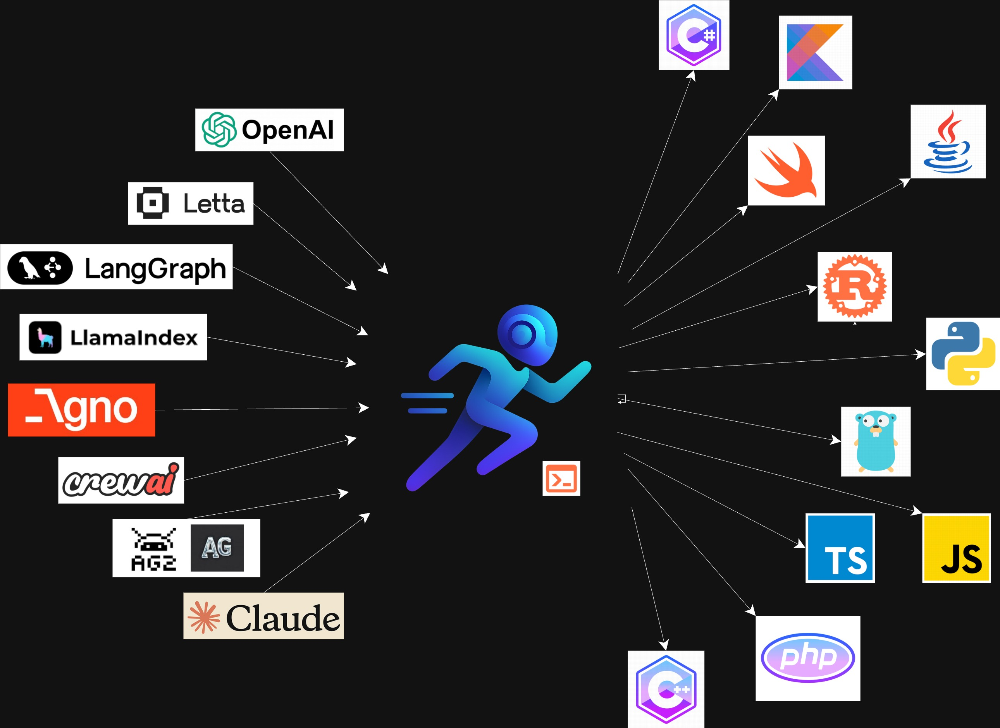
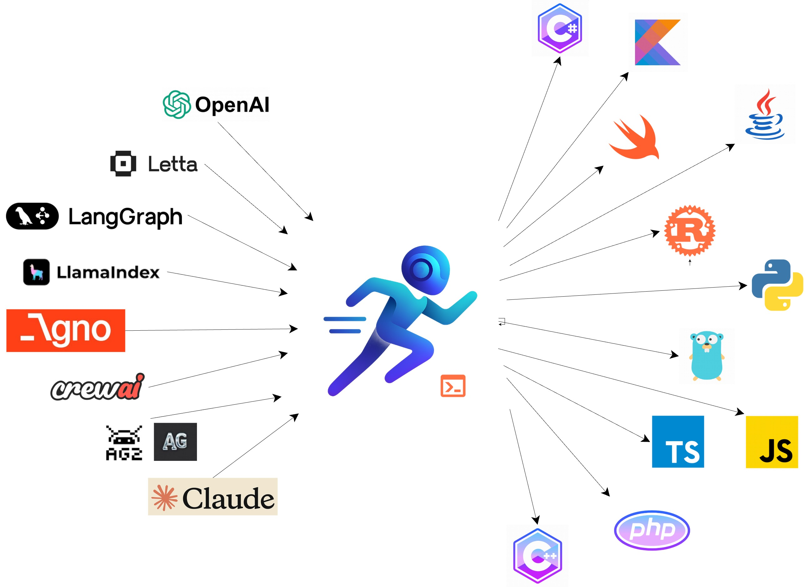

<p align="center">
  <a href="https://run-agent.ai/#gh-dark-mode-only">
    
  </a>
  <a href="https://run-agent.ai/#gh-light-mode-only">
    
  </a>
</p>

<h2 align="center">
  Universal AI Agent Platform
</h2>

<h3 align="center">
  Build in Python, Deploy Anywhere, Access from Any Language
</h3>

<p align="center">
  <a href="https://docs.run-agent.ai">
    
  </a>
</p>

<p align="center">
  <a href="https://pypi.org/project/runagent/">
    
  </a>
  <a href="https://pypi.org/project/runagent/">
    
  </a>
  <a href="https://pypi.org/project/runagent/">
    
  </a>
  <a href="https://discord.gg/Q9P9AdHVHz">
    
  </a>
</p>

<p align="center">
  <strong>Write AI agents once in Python, access them natively from any language.</strong><br>
  <strong>Deploy locally today, or on our serverless cloud platform (coming soon).</strong>
</p>

<p align="center">
  <a href="#-features">Features</a> •
  <a href="#-quickstartdeploying-an-agent">Quick Start</a> •
  <a href="#-cli">CLI</a> •
  <a href="#-documentation">Documentation</a> •
  <a href="#-contributing">Contributing</a>
</p>

---
## 📖 Table of Contents

- [📖 Table of Contents](#-table-of-contents)
- [🎯 What is RunAgent?](#-what-is-runagent)
  - [Why RunAgent?](#why-runagent)
  - [Perfect For:](#perfect-for)
- [✨ Features](#-features)
  - [🌐 Universal Access](#-universal-access)
  - [🖥️ Powerful CLI](#️-powerful-cli)
  - [📚 Multi-Language SDKs](#-multi-language-sdks)
  - [🏗️ Deployment Options](#️-deployment-options)
- [🚀 QuickStart(Deploying an Agent)](#-quickstartdeploying-an-agent)
  - [1. Installation](#1-installation)
  - [2. Initialize from a template:](#2-initialize-from-a-template)
  - [3. Configure your agent (`runagent.config.json`):](#3-configure-your-agent-runagentconfigjson)
  - [4. Serve your agent (built-in runagent server):](#4-serve-your-agent-built-in-runagent-server)
  - [5. Deploy agent on RunAgent Cloud - Serverless (coming soon):](#5-deploy-agent-on-runagent-cloud---serverless-coming-soon)
- [🚀 QuickStart(Use a Deployed Agent)](#-quickstartuse-a-deployed-agent)
  - [Python SDK](#python-sdk)
  - [Rust SDK](#rust-sdk)
  - [JavaScript/ TypeScript SDK](#javascript-typescript-sdk)
  - [Go SDK](#go-sdk)
- [🌊 Advanced: Streaming Responses](#-advanced-streaming-responses)
- [🔧 CLI](#-cli)
- [🎨 Framework Support](#-framework-support)
  - [Supported Frameworks:](#supported-frameworks)
  - [Framework Templates:](#framework-templates)
- [🏢 Enterprise Features (Coming Soon)](#-enterprise-features-coming-soon)
- [📚 Documentation](#-documentation)
  - [Getting Started](#getting-started)
  - [SDK Documentation](#sdk-documentation)
  - [CLI Documentation](#cli-documentation)
  - [Configuration \& Deployment](#configuration--deployment)
  - [API Reference](#api-reference)
  - [Resources](#resources)
- [🗺️ Platform Evolution Roadmap](#️-platform-evolution-roadmap)
  - [✅ Foundation (Available Now)](#-foundation-available-now)
  - [🚧 Cloud Platform (Coming Q2 2025)](#-cloud-platform-coming-q2-2025)
  - [🔮 Enterprise (Coming 2025)](#-enterprise-coming-2025)
- [🤝 Contributing](#-contributing)
  - [Ways to Contribute:](#ways-to-contribute)
  - [Development Setup:](#development-setup)
  - [Contribution Guidelines:](#contribution-guidelines)
- [💬 Community \& Support](#-community--support)
  - [Community Channels:](#community-channels)
  - [Getting Help:](#getting-help)
  - [Stay Updated:](#stay-updated)
- [📄 License](#-license)
- [🙏 Acknowledgments](#-acknowledgments)
  - [Core Technologies:](#core-technologies)
  - [AI Framework Communities:](#ai-framework-communities)
  - [Open Source Inspiration:](#open-source-inspiration)
  - [Our Community:](#our-community)
  - [Special Thanks:](#special-thanks)

---
## 🎯 What is RunAgent?

RunAgent is a revolutionary platform that solves the **language barrier problem** in AI development. Write your AI agents once in Python using any framework, then access them natively from Rust, JavaScript, Go, or any other language(Python itself) through our comprehensive SDKs. No more REST API complexity, no more language barriers - just seamless AI agent integration across your entire technology stack.

With RunAgent, you get both a powerful local development environment and a clear path to production-scale serverless deployment. Whether you're building a prototype on your laptop or scaling to millions of users, RunAgent provides the infrastructure and tools to deploy your agents seamlessly.

<div style="width:100%;display:flex;justify-content:center;align-items:center;">
  <a href="https://run-agent.ai/#gh-dark-mode-only" style="flex:1;">
    
  </a>
  <a href="https://run-agent.ai/#gh-light-mode-only" style="flex:1;">
    
  </a>
</div>

### Why RunAgent?

- **🌐 Universal Access**: Write agents in Python, use them natively in **any language** - no API complexity
- **🚀 Deploy in Minutes**: From local development to production with a single command
- **🔧 Framework Agnostic**: Works with any AI agent framework - LangChain, LangGraph, CrewAI, or custom
- **🌊 Native Streaming**: Real-time agent responses that feel natural in every programming language
- **📦 Smart Architecture**: Local development today, serverless cloud deployment tomorrow
- **🛡️ Production Ready**: Built-in monitoring, logging, and debugging tools included
- **📊 Developer Experience**: Intuitive CLI, comprehensive SDKs, and extensive documentation

### Perfect For:
- **Polyglot Teams**: Python AI experts collaborating with frontend (JS/TS) and backend (Rust/Go) developers
- **Microservices Architecture**: Centralized AI logic with distributed access across your service mesh
- **Legacy Integration**: Add cutting-edge AI capabilities to existing applications without rewrites
- **Performance Critical Apps**: Write AI logic in Python, consume from high-performance languages
- **Rapid Prototyping**: Quick local development with seamless production deployment path

## ✨ Features

### 🌐 Universal Access

RunAgent's core innovation is making Python AI agents accessible from any programming language through native-feeling SDKs. No more wrestling with REST APIs, handling HTTP errors, or building custom serialization. Your agents feel like local functions, complete with:

- **Type Safety**: Full type annotations and intellisense support
- **Error Handling**: Native exception handling in each language
- **Authentication**: Seamless security without manual token management
- **Connection Management**: Automatic retries, timeouts, and connection pooling

### 🖥️ Powerful CLI

The RunAgent CLI is your command center for the entire agent lifecycle:

- **Smart Initialization**: Create projects from framework-specific templates with `runagent init`
- **Local Development Server**: Full-featured FastAPI server with both REST and WebSocket support
- **Hot Reload**: Instant updates during development without server restarts
- **Environment Management**: Separate configurations for development, staging, and production
- **One-Command Deployment**: Deploy to cloud infrastructure with `runagent deploy` (coming soon)
- **Real-time Monitoring**: Built-in logging, metrics, and debugging capabilities

### 📚 Multi-Language SDKs

Our SDKs provide a truly native experience in every supported language:

- **Python SDK** - `pip install runagent` - [Full Documentation](https://docs.run-agent.ai/sdk/python/getting-started.md)
- **JavaScript SDK** - `npm install runagent` - [Coming Soon](https://docs.run-agent.ai/sdk/coming-soon.md)
- **Rust SDK** - Native async/await support with excellent performance
- **Go SDK** - Idiomatic Go with full context support


Each SDK includes:

- Synchronous and asynchronous client options
- Native streaming support with language-specific iterators
- Comprehensive error handling and retry logic
- Full type safety and IDE support
- Extensive examples and documentation

### 🏗️ Deployment Options

**🏠 Local Development (Available Now)**
- Full-featured development server with hot reload
- Complete debugging and monitoring capabilities
- Perfect for development, testing, and self-hosting
- Support for complex agent workflows and multi-step processes

**☁️ Serverless Cloud (Coming Soon)**
- Auto-scaling infrastructure that scales to zero when idle
- Global edge deployment for minimal latency worldwide
- Pay-per-use pricing model - only pay for what you consume
- Built-in monitoring, analytics, and alerting
- Webhook support for event-driven architectures

**🏢 Enterprise (Future)**
- Private cloud deployment in your own infrastructure
- Advanced security features and compliance (SOC2, GDPR)
- Custom SLAs and dedicated support
- Role-based access control and audit logging

---

## 🚀 QuickStart(Deploying an Agent)

RunAgent provides a comprehensive toolset for both deploying agents from any framework and consuming those agents in your applications. The Python SDK is bundled with the CLI, while other language SDKs are available from their respective package repositories.

### 1. Installation

```bash
pip install runagent
```

Learn more about installation options in our [Installation Guide](https://docs.run-agent.ai/get-started/installation.md).

### 2. Initialize from a template:

We've created comprehensive [templates](./templates) covering most supported frameworks. These serve as both examples and starting points, and you can initialize them with the `runagent init` command.

```bash
# Framework-specific templates:
runagent init my_agent --langgraph    # LangGraph template
runagent init my_agent --crewai       # CrewAI template
runagent init my_agent --letta        # Letta template
runagent init my_agent --agno         # Agno template

# Create a minimal project:
runagent init my_agent
```

See all available framework templates in our [Frameworks Overview](https://docs.run-agent.ai/frameworks/overview.md).

If we examine the directory structure:

```bash
my-agent/
├── __init__.py
├── email_agent.py
├── main.py
└── runagent.config.json
```

The most important file in any RunAgent project is `runagent.config.json`, which contains project metadata and the list of `entrypoints` - the functions/methods from your codebase that will be exposed through the RunAgent server.

> **Key Concept**: `entrypoints` are the single most important concept in the RunAgent ecosystem. They define which functions in your code become accessible through our SDKs. Learn more in [Core Concepts](https://docs.run-agent.ai/get-started/core-concepts.md).

### 3. Configure your agent (`runagent.config.json`):

Let's examine the `main.py` content (partial):

```python
from .email_agent import MockOpenAIClient
from typing import Iterator


def mock_response(message, role="user"):
    """Test the mock agent with non-streaming responses"""
    client = MockOpenAIClient()

    prompt = [
        {
            "role": role,
            "content": message
        }
    ]
    response = client.create(model="gpt-4", messages=prompt)

    print(response.content)
    print(f"\nTokens used: {response.usage_tokens}")
    print(f"Response time: {response.response_time:.2f}s")

    return response.content


def mock_response_stream(message, role="user") -> Iterator[str]:
    """Test the mock agent with streaming responses"""
    client = MockOpenAIClient()
    prompt = [
        {
            "role": role,
            "content": message
        }
    ]
    for chunk in client.create(
        model="gpt-4",
        messages=prompt,
        stream=True
    ):
        if not chunk.finished:
            yield chunk.delta
        else:
            yield "\n[STREAM COMPLETE]"
```

The functions `mock_response` and `mock_response_stream` will serve as agent entrypoints. We specify these in the `runagent.config.json` file:

```json
{
  "agent_name": "my-agent",
  "description": "A simple placeholder agent",
  "framework": "default",
  "template": "default",
  "version": "1.0.0",
  "created_at": "2025-07-11 15:08:18",
  "template_source": {
    "repo_url": "https://github.com/runagent-dev/runagent.git",
    "author": "sawradip",
    "path": "templates/default"
  },
  "agent_architecture": {
    "entrypoints": [
      {
        "file": "main.py",
        "module": "mock_response",
        "tag": "minimal"
      },
      {
        "file": "main.py",
        "module": "mock_response_stream",
        "tag": "minimal_stream"
      }
    ]
  },
  "env_vars": {}
}
```

Each entrypoint record specifies:
- **file**: Relative (or absolute) path to the file containing the entrypoint function
- **module**: The function name to expose
- **tag**: Unique identifier for this entrypoint within the project

**Important**: For streaming entrypoints (like `mock_response_stream`), the tag should include a `_stream` suffix to indicate streaming capability.

Learn more about configuration in our [Configuration File Guide](https://docs.run-agent.ai/configuration/config-file.md).

### 4. Serve your agent (built-in runagent server):

```bash
# Start the local development server
runagent serve <project_dir>

# If you're inside the project directory:
runagent serve .

# Using project name also works:
runagent serve my_agent
```

This command starts a local FastAPI server and provides you with:
- An `agent_id` for programmatic access
- A `host:port` URL for HTTP access
- WebSocket endpoints for streaming
- A development dashboard for monitoring

You can use either the `agent_id` or `host:port` combination with `RunAgentClient` from any RunAgent SDK.

See more details in our [Local Development Guide](https://docs.run-agent.ai/deployment/local-development.md).

### 5. Deploy agent on RunAgent Cloud - Serverless (coming soon):

```bash
# Deploy to production cloud infrastructure
runagent deploy <project_dir>
```

Cloud deployment will provide:
- Automatic scaling based on demand
- Global edge distribution
- Built-in monitoring and analytics
- Webhook integrations
- Production-grade security

Learn more about our upcoming [Cloud Deployment](https://docs.run-agent.ai/deployment/cloud-deployment.md) features.

## 🚀 QuickStart(Use a Deployed Agent)

RunAgent provides SDKs for multiple languages, with more being added continuously. If you need support for a specific language or want to contribute, join our [Discord](https://discord.gg/runagent) or raise an issue.

Remember the `agent_id`, URL (`host:port`), and `tag` from the deployment step. With our SDKs, you can access the `entrypoints` (defined in `runagent.config.json`) like native functions - even for streaming responses. We handle all the complex communication in the background.

### Python SDK

The Python SDK is already installed when you install the CLI. Let's connect to our agent using the `minimal` tag, which corresponds to `def mock_response(message, role="user"):`.

```python
from runagent import RunAgentClient

# Connect using agent_id
ra = RunAgentClient(
    agent_id="<agent_id>",
    entrypoint_tag="<tag>",
    local=True  # You're running a local server
)

# Or connect using host:port
ra = RunAgentClient(
    host="<host>", 
    port=<port>, 
    entrypoint_tag="<tag>", 
    local=True
)
```

The magic of RunAgent SDKs is that you can invoke the `RunAgentClient.run` method as if it were the target entrypoint function. Since our function signature is `def mock_response(message, role="user"):`, you can call:

```python
agent_results = ra.run(
    role="user",
    message="Analyze the benefits of remote work for software teams"
)
print(agent_results)
```

Complete example:
```python
from runagent import RunAgentClient

ra = RunAgentClient(
    agent_id="<agent_id>",
    entrypoint_tag="<tag>",
    local=True
)

agent_results = ra.run(
    role="user",
    message="Analyze the benefits of remote work for software teams"
)

print(agent_results)
```

**Streaming Support**: For streaming functions, you can iterate over the returned object naturally:

```python
from runagent import RunAgentClient

ra = RunAgentClient(
    agent_id="<agent_id>",
    entrypoint_tag="<tag>_stream",  # Note the _stream suffix
    local=True
)

for chunk in ra.run(
    role="user", 
    message="Analyze the benefits of remote work for software teams"
):
    print(chunk, end='')
```

Learn more in our [Python SDK Documentation](https://docs.run-agent.ai/sdk/python/getting-started.md).

### Rust SDK

**Non-streaming Example:**

```rust 
use runagent::client::RunAgentClient;
use serde_json::json;

#[tokio::main]
async fn main() -> Result<(), Box<dyn std::error::Error>> {
    // Connect to agent
    let client = RunAgentClient::new("<agent_id>", "<tag>", true).await?;
    
    // Simple invocation with native Rust types
    let result = client.run(&[
        ("message", json!("Help me plan a trip to Japan")),
        ("role", json!("user"))
    ]).await?;
    
    println!("Result: {}", result);
    Ok(())
}
```

**Streaming Example:**

```rust
use runagent::client::RunAgentClient;
use serde_json::json;
use futures::StreamExt;

#[tokio::main]
async fn main() -> Result<(), Box<dyn std::error::Error>> {
    // Stream responses for real-time interaction
    let client = RunAgentClient::new("<agent_id>", "<tag>_stream", true).await?;
    let mut stream = client.run_stream(&[
        ("message", json!("Explain quantum computing step by step")),
        ("role", json!("user"))
    ]).await?;
    
    while let Some(chunk) = stream.next().await {
        print!("{}", chunk?);
    }
    
    Ok(())
}
```

### JavaScript/ TypeScript SDK

Create an `.mjs` file or add `"type": "module"` to your `package.json`.

**Non-streaming Example:**

```javascript
import { RunAgentClient } from 'runagent';

const ra = new RunAgentClient({
  agentId: "<agent_id>",
  host: "<host>",
  port: <port>,
  entrypointTag: "minimal",
  local: true
});

await ra.initialize();

const solutionResult = await ra.run({
  role: 'user',
  message: 'Analyze the benefits of remote work for software teams',
});

console.log(solutionResult);
```

**Streaming Example:**

```javascript
import { RunAgentClient } from 'runagent';

const ra = new RunAgentClient({
  agentId: "<agent_id>",
  host: "<host>",
  port: <port>,
  entrypointTag: "minimal_stream",
  local: true
});

await ra.initialize();

const stream = await ra.run({
  role: 'user',
  message: 'Write a detailed analysis of remote work benefits',
});

for await (const chunk of stream) {
  process.stdout.write(chunk);
}
```

### Go SDK

**Non-streaming Example:**

```go
package main

import (
	"context"
	"fmt"
	"log"
	"time"

	"github.com/runagent-dev/runagent/runagent-go/runagent"
)

func main() {
	fmt.Println("=== RunAgent Go SDK Example ===")

	config := runagent.Config{
		AgentID:       "<agent_id>",
		EntrypointTag: "minimal",
		Host:          "<host>",
		Port:          <port>,
		Local:         true,
	}

	client := runagent.NewRunAgentClient(config)

	ctx, cancel := context.WithTimeout(context.Background(), 2*time.Minute)
	defer cancel()

	if err := client.Initialize(ctx); err != nil {
		log.Fatalf("Failed to initialize: %v", err)
	}

	result, err := client.Run(ctx, map[string]interface{}{
		"role":    "user",
		"message": "Analyze the benefits of remote work for software teams",
	})
	if err != nil {
		log.Fatalf("Failed to run agent: %v", err)
	}

	fmt.Printf("Result: %v\n", result)
}
```

**Streaming Example:**

```go
package main

import (
	"context"
	"fmt"
	"log"
	"time"

	"github.com/runagent-dev/runagent/runagent-go/runagent"
)

func main() {
	fmt.Println("=== Streaming Agent Example ===")

	client := runagent.NewRunAgentClient(runagent.Config{
		AgentID:       "<agent_id>",
		EntrypointTag: "minimal_stream",
		Host:          "<host>",
		Port:          <port>,
		Local:         true,
	})

	ctx, cancel := context.WithTimeout(context.Background(), 5*time.Minute)
	defer cancel()

	if err := client.Initialize(ctx); err != nil {
		log.Fatalf("Failed to initialize: %v", err)
	}

	result, err := client.Run(ctx, map[string]interface{}{
		"role":    "user",
		"message": "Write a detailed analysis of remote work benefits",
	})
	if err != nil {
		log.Fatalf("Failed to start streaming: %v", err)
	}

	stream := result.(*runagent.StreamIterator)
	defer stream.Close()

	fmt.Println("📡 Streaming response:")
	fmt.Println("----------------------------------------")

	for {
		chunk, hasMore, err := stream.Next(ctx)
		if err != nil {
			log.Printf("Stream error: %v", err)
			break
		}
		if !hasMore {
			break
		}
		if chunk != nil {
			fmt.Print(chunk)
		}
	}

	fmt.Println("\n✅ Stream completed!")
}
```

---

## 🌊 Advanced: Streaming Responses

One of RunAgent's most powerful features is **native streaming support** across all languages. Streaming responses feel natural and idiomatic in each programming language:

**Python** - Uses Python iterators:
```python
for chunk in client.run(message="Generate a long story"):
    print(chunk, end='')
```

**JavaScript** - Uses async iterators:
```javascript
for await (const chunk of client.run({message: "Generate a long story"})) {
    process.stdout.write(chunk);
}
```

**Rust** - Uses futures streams:
```rust
while let Some(chunk) = stream.next().await {
    print!("{}", chunk?);
}
```

**Go** - Uses context-aware iterators:
```go
for {
    chunk, hasMore, err := stream.Next(ctx)
    if !hasMore { break }
    fmt.Print(chunk)
}
```

Learn more about streaming in our [Streaming Responses Guide](https://docs.run-agent.ai/sdk/python/streaming.md).

---
## 🔧 CLI

The RunAgent CLI is your command center for agent operations. Here's the complete reference:

| Command | Description | Documentation |
|---------|-------------|---------------|
| `runagent init` | Create a new agent project from templates | [CLI Reference](https://docs.run-agent.ai/cli/commands/init.md) |
| `runagent serve` | Run agent locally for development | [CLI Reference](https://docs.run-agent.ai/cli/commands/serve.md) |
| `runagent deploy` | Deploy to cloud (coming soon) | [CLI Reference](https://docs.run-agent.ai/cli/commands/deploy.md) |
| `runagent run` | Execute a deployed agent | [CLI Reference](https://docs.run-agent.ai/cli/commands/run.md) |
| `runagent setup` | Configure authentication | [CLI Reference](https://docs.run-agent.ai/cli/commands/setup.md) |
| `runagent template` | Manage project templates | [CLI Reference](https://docs.run-agent.ai/cli/commands/template.md) |
| `runagent upload` | Upload agent to remote server | [CLI Reference](https://docs.run-agent.ai/cli/commands/upload.md) |
| `runagent start` | Start an uploaded agent | [CLI Reference](https://docs.run-agent.ai/cli/commands/start.md) |
| `runagent teardown` | Remove RunAgent configuration | [CLI Reference](https://docs.run-agent.ai/cli/commands/teardown.md) |

See our [CLI Overview](https://docs.run-agent.ai/cli/overview.md) and [CLI Examples](https://docs.run-agent.ai/cli/examples.md) for comprehensive usage patterns.

## 🎨 Framework Support

RunAgent works with any Python AI framework. We provide pre-built templates and specific guides for popular frameworks:

### Supported Frameworks:
- **[LangGraph](https://docs.run-agent.ai/frameworks/langgraph.md)** - Deploy LangGraph agents with full graph support
- **[CrewAI](https://docs.run-agent.ai/frameworks/crewai.md)** - Deploy multi-agent CrewAI systems  
- **[Letta](https://docs.run-agent.ai/frameworks/letta.md)** - Deploy Letta agents with long-term memory
- **[Agno](https://docs.run-agent.ai/frameworks/agno.md)** - Deploy Agno agents with built-in reasoning
- **[Custom Frameworks](https://docs.run-agent.ai/frameworks/custom.md)** - Deploy agents built with any Python framework

### Framework Templates:
```bash
runagent init my-agent --langgraph    # LangGraph template
runagent init my-agent --crewai       # CrewAI multi-agent template  
runagent init my-agent --letta        # Letta memory-enabled template
runagent init my-agent --agno         # Agno reasoning template
runagent init my-agent --custom       # Custom framework template
```

See our [Frameworks Overview](https://docs.run-agent.ai/frameworks/overview.md) for detailed guides on each framework.

## 🏢 Enterprise Features (Coming Soon)

RunAgent's enterprise tier will provide production-grade features for organizations:

- **Private Cloud Deployment**: Run RunAgent in your own infrastructure
- **Advanced Security**: SOC2 compliance, encryption at rest and in transit
- **Team Collaboration**: Shared agents, role-based access control, audit logs
- **Custom Domains**: Deploy agents to your own domains with SSL
- **SLA Support**: 99.9% uptime guarantee with dedicated support
- **Advanced Monitoring**: Custom dashboards, alerts, and analytics
- **Compliance**: GDPR, HIPAA, and industry-specific compliance features

---

## 📚 Documentation

Our comprehensive documentation covers every aspect of RunAgent development and deployment:

### Getting Started
- **[Introduction](https://docs.run-agent.ai/get-started/introduction.md)** - Deploy AI agents to production in seconds
- **[Installation](https://docs.run-agent.ai/get-started/installation.md)** - Install RunAgent CLI and SDK
- **[Quick Start](https://docs.run-agent.ai/get-started/quickstart.md)** - Deploy your first agent in under 5 minutes
- **[Core Concepts](https://docs.run-agent.ai/get-started/core-concepts.md)** - Master fundamental RunAgent concepts

### SDK Documentation
- **[SDK Overview](https://docs.run-agent.ai/sdk/overview.md)** - Overview of all RunAgent SDKs
- **[Python SDK](https://docs.run-agent.ai/sdk/python/getting-started.md)** - Complete Python SDK guide
  - **[API Reference](https://docs.run-agent.ai/sdk/python/api-reference.md)** - Complete API documentation
  - **[Synchronous Client](https://docs.run-agent.ai/sdk/python/sync-client.md)** - Using sync clients
  - **[Asynchronous Client](https://docs.run-agent.ai/sdk/python/async-client.md)** - Using async clients
  - **[Streaming Responses](https://docs.run-agent.ai/sdk/python/streaming.md)** - Real-time streaming
- **[Coming Soon: Additional SDKs](https://docs.run-agent.ai/sdk/coming-soon.md)** - JavaScript, Rust, Go SDKs

### CLI Documentation
- **[CLI Overview](https://docs.run-agent.ai/cli/overview.md)** - Master the command-line interface
- **[CLI Examples](https://docs.run-agent.ai/cli/examples.md)** - Common usage patterns
- **Command References**: [init](https://docs.run-agent.ai/cli/commands/init.md), [serve](https://docs.run-agent.ai/cli/commands/serve.md), [deploy](https://docs.run-agent.ai/cli/commands/deploy.md), [run](https://docs.run-agent.ai/cli/commands/run.md), [setup](https://docs.run-agent.ai/cli/commands/setup.md), [template](https://docs.run-agent.ai/cli/commands/template.md), [upload](https://docs.run-agent.ai/cli/commands/upload.md), [start](https://docs.run-agent.ai/cli/commands/start.md), [teardown](https://docs.run-agent.ai/cli/commands/teardown.md)

### Configuration & Deployment
- **[Configuration File](https://docs.run-agent.ai/configuration/config-file.md)** - Understanding runagent.config.json
- **[Project Structure](https://docs.run-agent.ai/configuration/project-structure.md)** - Understanding RunAgent project organization
- **[Environment Variables](https://docs.run-agent.ai/configuration/environment.md)** - Managing environment variables and secrets
- **[Local Development](https://docs.run-agent.ai/deployment/local-development.md)** - Running and testing agents locally
- **[Cloud Deployment](https://docs.run-agent.ai/deployment/cloud-deployment.md)** - Deploy to RunAgent cloud infrastructure

### API Reference
- **[API Introduction](https://docs.run-agent.ai/api-reference/introduction.md)** - RESTful API for interacting with RunAgent
- **[Authentication](https://docs.run-agent.ai/api-reference/authentication.md)** - API authentication and security
- **[Rate Limits](https://docs.run-agent.ai/api-reference/rate-limits.md)** - API rate limiting and quotas
- **[Error Handling](https://docs.run-agent.ai/api-reference/errors.md)** - Understanding and handling API errors
- **Endpoints**: [Health Check](https://docs.run-agent.ai/api-reference/endpoints/health.md), [Invoke Agent](https://docs.run-agent.ai/api-reference/endpoints/invoke.md), [Stream Agent Response](https://docs.run-agent.ai/api-reference/endpoints/stream.md)
- **[Webhooks](https://docs.run-agent.ai/api-reference/webhooks.md)** - Receive real-time notifications for agent events

### Resources
- **[Examples](https://docs.run-agent.ai/resources/examples.md)** - Example agents and code snippets
- **[Troubleshooting Guide](https://docs.run-agent.ai/resources/troubleshooting.md)** - Common issues and solutions
- **[Frequently Asked Questions](https://docs.run-agent.ai/resources/faq.md)** - Common questions about RunAgent

## 🗺️ Platform Evolution Roadmap

### ✅ Foundation (Available Now)

Our current open-source foundation provides everything you need for local development and self-hosting:

- **Cross-Language SDKs**: Python, JavaScript, Rust, and Go SDKs with native streaming
- **Local Development Server**: Full-featured FastAPI server with hot reload
- **Framework-Agnostic Support**: Works with LangChain, LangGraph, CrewAI, Letta, Agno, or any Python framework
- **Pre-Built Templates**: Quick-start templates for popular AI frameworks
- **Comprehensive CLI**: Complete command-line interface for project management
- **Real-Time Debugging**: Built-in logging, monitoring, and debugging tools
- **Production-Ready**: Suitable for self-hosting and enterprise deployments

### 🚧 Cloud Platform (Coming Q2 2025)

Our serverless cloud platform will provide effortless scaling and production deployment:

- **One-Command Deployment**: Deploy with `runagent deploy` to auto-scaling infrastructure
- **Global Edge Network**: Deploy agents across multiple regions for minimal latency
- **Auto-Scaling**: Scale from zero to thousands of concurrent requests automatically
- **Built-in Monitoring**: Real-time dashboards, metrics, and alerting
- **Webhook Integrations**: Event-driven architectures with HTTP callbacks
- **Team Collaboration**: Shared agents, environment management, and access controls
- **Usage Analytics**: Detailed insights into agent performance and usage patterns
- **API Gateway**: Advanced routing, rate limiting, and authentication features

### 🔮 Enterprise (Coming 2025)

Enterprise features for organizations requiring advanced security and control:

- **Private Cloud Deployment**: Run RunAgent in your own infrastructure (AWS, GCP, Azure)
- **Advanced Security**: SOC2 Type II compliance, encryption at rest and in transit
- **Compliance Features**: GDPR, HIPAA, and industry-specific compliance tools
- **Role-Based Access Control**: Fine-grained permissions and audit logging
- **Custom SLAs**: 99.9% uptime guarantees with dedicated support
- **Custom Runtime Environments**: Specialized containers and security sandboxes
- **Enterprise Integrations**: SSO, LDAP, and enterprise directory services
- **Advanced Analytics**: Custom reporting, data export, and business intelligence

---
## 🤝 Contributing

We welcome contributions from the community! RunAgent is built by developers, for developers, and we're excited to have you join us.

### Ways to Contribute:
- **Bug Reports**: Found an issue? Report it on [GitHub Issues](https://github.com/runagent-dev/runagent/issues)
- **Feature Requests**: Have an idea? Share it in [GitHub Discussions](https://github.com/runagent-dev/runagent/discussions)
- **Code Contributions**: Submit pull requests for bug fixes or new features
- **Documentation**: Help improve our guides, examples, and API documentation
- **Community Support**: Help other developers in Discord and GitHub discussions
- **SDK Development**: Contribute to existing SDKs or help build new language support

### Development Setup:

```bash
# Clone the repository
git clone https://github.com/runagent-dev/runagent.git
cd runagent

# Install development dependencies
pip install -e ".[dev]"

# Run tests
pytest

# Format code
black runagent tests

# Run linting
flake8 runagent tests

# Type checking
mypy runagent
```

### Contribution Guidelines:
- Follow our [Code of Conduct](CODE_OF_CONDUCT.md)
- Write tests for new features and bug fixes
- Follow existing code style and conventions
- Update documentation for any user-facing changes
- Add appropriate type hints for Python code

See our detailed [Contributing Guide](CONTRIBUTING.md) for more information.

## 💬 Community & Support

Join our growing community of AI developers and get support from both the team and fellow users:

### Community Channels:
- **[Discord Community](https://discord.gg/Q9P9AdHVHz)** - Real-time chat with developers, get help, and share projects
- **[GitHub Discussions](https://github.com/runagent-dev/runagent/discussions)** - Ask questions, share ideas, and discuss features
- **[Twitter](https://twitter.com/run_agent)** - Follow for updates, announcements, and AI development tips
- **[Blog](https://run-agent.ai/blog)** - In-depth tutorials, best practices, and case studies

### Getting Help:
- **Technical Issues**: Check our [Troubleshooting Guide](https://docs.run-agent.ai/resources/troubleshooting.md) first
- **General Questions**: Browse our [FAQ](https://docs.run-agent.ai/resources/faq.md)
- **Community Support**: Ask in Discord or GitHub Discussions
- **Bug Reports**: Create an issue on GitHub with detailed reproduction steps

### Stay Updated:
- **GitHub Releases**: Watch our repository for new releases and features
- **Newsletter**: Subscribe on our website for monthly updates and tutorials
- **Social Media**: Follow us on Twitter for daily updates and community highlights

## 📄 License
RunAgent is licensed under the Elastic License 2.0 (ELv2).
What this means:

✅ Free to use for development, testing, and production<br>
✅ Modify and distribute as needed<br>
✅ Commercial use in your applications<br>
❌ Cannot offer RunAgent as a managed service without permission<br>

This license ensures RunAgent remains freely available while protecting against unfair competition from cloud providers.
See the LICENSE file for complete terms.
## 🙏 Acknowledgments

RunAgent stands on the shoulders of giants. We're grateful to the entire AI and open-source community, especially:

### Core Technologies:
- **[FastAPI](https://fastapi.tiangolo.com/)** - For the blazingly fast API framework that powers our local server
- **[Pydantic](https://pydantic-docs.helpmanual.io/)** - For data validation and serialization
- **[Uvicorn](https://www.uvicorn.org/)** - For the lightning-fast ASGI server

### AI Framework Communities:
- **[LangChain](https://langchain.com/)** and **[LangGraph](https://langchain-ai.github.io/langgraph/)** - For pioneering AI agent frameworks
- **[LlamaIndex](https://llamaindex.ai/)** - For advancing RAG and knowledge-based AI systems
- **[CrewAI](https://crewai.com/)** - For multi-agent system innovations
- **[Letta](https://letta.ai/)** - For advancing memory-enabled conversational AI

### Open Source Inspiration:
- **[Vercel](https://vercel.com/)** - For inspiration in developer experience and deployment simplicity
- **[Supabase](https://supabase.com/)** - For demonstrating the power of open-source alternatives
- **[Hugging Face](https://huggingface.co/)** - For democratizing AI and fostering community

### Our Community:
- **Contributors** - Everyone who has submitted code, documentation, or bug reports
- **Early Adopters** - Beta users who provided feedback and shaped our roadmap
- **Discord Community** - Active members who help each other and improve RunAgent
- **Framework Maintainers** - Teams behind the AI frameworks we support

### Special Thanks:
- All the developers building amazing AI applications with RunAgent
- The broader Python and AI communities for continuous innovation
- Everyone who believes in making AI development more accessible

---

<p align="center">
  <strong>Ready to build universal AI agents?</strong>
</p>

<p align="center">
  <a href="https://run-agent.ai">
    
  </a>
  <a href="https://run-agent.ai/waitlist">
    
  </a>
</p>

<p align="center">
  <a href="https://github.com/runagent-dev/runagent">🌟 Star us on GitHub</a> •
  <a href="https://discord.gg/runagent">💬 Join Discord</a> •
  <a href="https://docs.run-agent.ai">📚 Read the Docs</a>
</p>

<p align="center">
  Made with ❤️ by the RunAgent Team
</p>