<p align="center">
  <a href="https://run-agent.ai/#gh-dark-mode-only">
    
  </a>
  <a href="https://run-agent.ai/#gh-light-mode-only">
    
  </a>
</p>

<h2 align="center">Secured, reliable AI agent deployment at scale</h2>

<h3 align="center">Write agent once, use everywhere</h3>

<p align="center">
  <a href="https://docs.run-agent.ai">
    
  </a>
</p>

<p align="center">
  <a href="https://pypi.org/project/runagent/">
    
  </a>
  <a href="https://pypi.org/project/runagent/">
    
  </a>
  <a href="https://pypi.org/project/runagent/">
    
  </a>
  <a href="https://discord.gg/Q9P9AdHVHz">
    
  </a>
</p>

---


## What is RunAgent?

RunAgent is an agentic ecosystem that enables developers to build AI agents once in Python using any python agentic frameworks like LangGraph, CrewAI, Letta, LlamaIndex, then access them natively from any programming language. The platform features stateful self-learning capabilities with RunAgent Memory (coming soon), allowing agents to retain context and improve it's action memory over time.
RunAgent has multi-language SDK support for seamless integration across TypeScript, JavaScript, Go, and other languages, eliminating the need to rewrite agents for different tech stacks. RunAgent Cloud provides automated deployment with serverless auto-scaling, comprehensive agent security, and real-time monitoring capabilities.


## Quick Start

### Installation

```bash
pip install runagent
```

### Initialize Your First Agent

```bash
# Choose from various frameworks
runagent init my-agent --langgraph    # LangGraph template
runagent init my-agent --crewai       # CrewAI template  
runagent init my-agent --letta        # Letta template
runagent init my-agent                # Basic template
```

## Agent Configuration

Every RunAgent project requires a `runagent.config.json` file that defines your agent's structure and entrypoints:

```mermaid
---
config:
  theme: redux-dark
---
flowchart TD
    A["runagent.config.json<br/>Main Configuration File<br/>═══════════════════"]
    A ---|Primary Components| B["Basic Information<br/>Agent Metadata<br/>─────────────────"]
    A ---|Primary Components| C["Agent Architecture<br/>Entrypoint Definitions<br/>─────────────────"] 
    A ---|Primary Components| D["Environment Variables<br/>API Keys & Settings<br/>─────────────────"]
    B -->|Contains| B1["▪ agent_name<br/>▪ description<br/>▪ framework<br/>▪ version"]
    C -->|Defines| C1["entrypoints<br/>Array of callable endpoints<br/>═════════════════════"]
    C1 ---|Implementation Types| C2["Python Functions<br/>LangGraph, CrewAI, OpenAI<br/>─────────────────────"]
    C1 ---|Implementation Types| C3["External Webhooks<br/>N8N, Zapier, HTTP APIs<br/>─────────────────────"]
    C2 -->|Required Fields| C2A["▪ file: Python file path<br/>▪ module: Function name<br/>▪ tag: Endpoint identifier<br/>─────────────────────"]
    C3 -->|Required Fields| C3A["▪ webhook_url: External URL<br/>▪ method: HTTP method<br/>▪ tag: Endpoint identifier<br/>─────────────────────"]
    D -->|Configuration| D1["Key-Value Pairs<br/>▪ OPENAI_API_KEY<br/>▪ Anthropic_API_KEY<br/>▪ Custom settings<br/>▪ Framework configs<br/>─────────────────"]
    C2A -.->|Examples| E["chat<br/>stream_chat<br/>process_data"]
    C3A -.->|Examples| F["food_doctor<br/>workflow_trigger<br/>external_api"]
    style A fill:none,stroke:#333,stroke-width:3px
    style B fill:none,stroke:#666,stroke-width:2px
    style C fill:none,stroke:#666,stroke-width:2px
    style D fill:none,stroke:#666,stroke-width:2px
    style C1 fill:none,stroke:#333,stroke-width:2px
    style E fill:none,stroke:#999,stroke-width:1px,stroke-dasharray: 5 5
    style F fill:none,stroke:#999,stroke-width:1px,stroke-dasharray: 5 5

```



### Example Configuration

```json
{
  "agent_name": "My AI Assistant",
  "description": "A helpful AI agent",
  "framework": "langchain",
  "version": "1.0.0",
  "agent_architecture": {
    "entrypoints": [
      {
        "file": "agent.py",
        "module": "chat_function",
        "tag": "chat"
      },
      {
        "file": "agent.py", 
        "module": "stream_function",
        "tag": "chat_stream"
      }
    ]
  },
  "env_vars": {
    "OPENAI_API_KEY": "your-api-key"
  }
}
```

## Local Deployment

Deploy and test your agents locally with full debugging capabilities.

### Deploy Agent Locally

```bash
cd my-agent
runagent serve .
```

This starts a local FastAPI server with:
- Auto-allocated ports to avoid conflicts
- Real-time debugging and logging  
- WebSocket support for streaming
- Built-in API documentation at `/docs`


##  **LangGraph Problem Solver Agent (An Example)**


<table>
<tr>
<td width="20%"><b> Python Agent</b></td>
<td width="20%"><b> Python SDK</b></td>
<td width="20%"><b> JavaScript SDK</b></td>
<td width="20%"><b> Rust SDK</b></td>
<td width="20%"><b> Go SDK</b></td>
</tr>
<tr>
<td valign="top">

```python
# agent.py
from langgraph.graph import StateGraph
from typing import TypedDict, List

class ProblemState(TypedDict):
    query: str
    num_solutions: int
    constraints: List[dict]
    solutions: List[str]
    validated: bool

def analyze_problem(state):
    # Problem analysis logic
    return {"solutions": [...]}

def validate_solutions(state):
    # Validation logic
    return {"validated": True}

# Build the graph
workflow = StateGraph(ProblemState)
workflow.add_node("analyze", analyze_problem)
workflow.add_node("validate", validate_solutions)
workflow.add_edge("analyze", "validate")
workflow.set_entry_point("analyze")

app = workflow.compile()

def solve_problem(query, num_solutions, constraints):
    result = app.invoke({
        "query": query,
        "num_solutions": num_solutions,
        "constraints": constraints
    })
    return result
```

</td>
<td valign="top">

```python
from runagent import RunAgentClient

client = RunAgentClient(
    agent_id="lg-solver-123",
    entrypoint_tag="solve_problem",
    local=True
)

result = client.run(
    query="My laptop is slow",
    num_solutions=3,
    constraints=[{
        "type": "budget", 
        "value": 100
    }]
)
print(result)

# Streaming
for chunk in client.run(
    query="Fix my phone", 
    num_solutions=4
):
    print(chunk)
```

</td>
<td valign="top">

```javascript
import { RunAgentClient } from 'runagent';

const client = new RunAgentClient({
  agentId: "lg-solver-123",
  entrypointTag: "solve_problem",
  local: true
});

await client.initialize();
const result = await client.run({
  query: "My laptop is slow",
  num_solutions: 3,
  constraints: [{
    type: "budget",
    value: 100
  }]
});
console.log(result);

// Streaming
for await (const chunk of client.run({
  query: "Fix my phone",
  num_solutions: 4
})) {
  process.stdout.write(chunk);
}
```

</td>
<td valign="top">

```rust
use runagent::client::RunAgentClient;
use serde_json::json;
use futures::StreamExt;

#[tokio::main]
async fn main() -> Result<(), Box<dyn std::error::Error>> {
    let client = RunAgentClient::new(
        "lg-solver-123", 
        "solve_problem", 
        true
    ).await?;
    
    let result = client.run(&[
        ("query", json!("My laptop is slow")),
        ("num_solutions", json!(3)),
        ("constraints", json!([{
            "type": "budget", 
            "value": 100
        }]))
    ]).await?;
    
    println!("Result: {}", result);
    
    // Streaming
    let mut stream = client.run_stream(&[
        ("query", json!("Fix my phone")),
        ("num_solutions", json!(4))
    ]).await?;
    
    while let Some(chunk) = stream.next().await {
        print!("{}", chunk?);
    }
    
    Ok(())
}
```

</td>
<td valign="top">

```go
package main

import (
    "context"
    "fmt"
    "github.com/runagent-dev/runagent-go/pkg/client"
)

func main() {
    client, _ := client.New(
        "lg-solver-123", 
        "solve_problem", 
        true
    )
    defer client.Close()

    result, _ := client.Run(
        context.Background(), 
        map[string]interface{}{
            "query": "My laptop is slow",
            "num_solutions": 3,
            "constraints": []map[string]interface{}{
                {"type": "budget", "value": 100},
            },
        }
    )
    fmt.Printf("Result: %v\n", result)

    // Streaming
    stream, _ := client.RunStream(
        context.Background(),
        map[string]interface{}{
            "query": "Fix my phone",
            "num_solutions": 4,
        }
    )
    defer stream.Close()

    for {
        chunk, hasMore, _ := stream.Next(context.Background())
        if !hasMore { break }
        fmt.Print(chunk)
    }
}
```

</td>
</tr>
</table>

---

## Action Memory System (Coming Soon)

RunAgent is introducing **Action Memory** - a revolutionary approach to agent reliability that focuses on *how to remember* rather than *what to remember*.

### How It Will Work

- **Action-Centric**: Instead of storing raw conversation data, it captures decision patterns and successful action sequences
- **Cross-Language**: Memory persists across all SDK languages seamlessly  
- **Reliability Focus**: Learns from successful outcomes to improve future decisions
- **Ecosystem Integration**: Works with any framework - LangGraph, CrewAI, Letta, and more

This will ensure your agents become more reliable over time, regardless of which programming language or framework you use to interact with them.

---

## Remote Deployment (Coming very soon)

Deploy your agents with enterprise-grade infrastructure and experience the fastest agent deployment.

### ⚡Fastest agent deployment

From zero to production in the time it takes to draw a breath, making **RunAgent** one of the fastest agent deployment platforms available on planet earth 🌍 .

### Security-First Architecture

Every agent runs in its own **isolated sandbox environment**:
- Complete process isolation
- Network segmentation  
- Resource limits and monitoring
- Zero data leakage between agents

### ✨ The +++999 Aura of Agent Deployment

Our remote deployment will provide:

- Auto-scaling based on demand
- Global edge distribution
- Built-in monitoring and analytics  
- Production-grade security and compliance

---


## Why Choose RunAgent?

**Universal Access**: Write in Python, use from any language - no API complexity

**Framework Agnostic**: Works with your existing agent code, regardless of framework

**Local + Remote**: Start local, scale to production seamlessly  

**Action Memory**: Built-in reliability system that learns from successful patterns

**Developer Experience**: Intuitive CLI, comprehensive SDKs, extensive documentation

**Production Ready**: Enterprise-grade security, monitoring, and performance

---

## Documentation

- **[Getting Started](https://docs.run-agent.ai/get-started/introduction.md)** - Deploy your first agent in 5 minutes
- **[CLI Reference](https://docs.run-agent.ai/cli/overview.md)** - Complete command-line interface guide  
- **[SDK Documentation](https://docs.run-agent.ai/sdk/overview.md)** - Multi-language SDK guides
- **[Framework Guides](https://docs.run-agent.ai/frameworks/overview.md)** - Framework-specific tutorials
- **[API Reference](https://docs.run-agent.ai/api-reference/introduction.md)** - REST API documentation

---

## Community & Support

<div align="center">

**[Discord Community](https://discord.gg/Q9P9AdHVHz)** • **[Documentation](https://docs.run-agent.ai)** • **[GitHub](https://github.com/runagent-dev/runagent)**

</div>

---

<div align="center">

**Ready to build universal AI agents?**

[**Get Started with Local Development →**](https://docs.run-agent.ai/get-started/quickstart.md)

</div>

<p align="center">
  <a href="https://github.com/runagent-dev/runagent">🌟 Star us on GitHub</a> •
  <a href="https://discord.gg/Q9P9AdHVHz">💬 Join Discord</a> •
  <a href="https://docs.run-agent.ai">📚 Read the Docs</a>
</p>


<p align="center">
  <sub>Made with ❤️ by the RunAgent Team</sub>
</p>