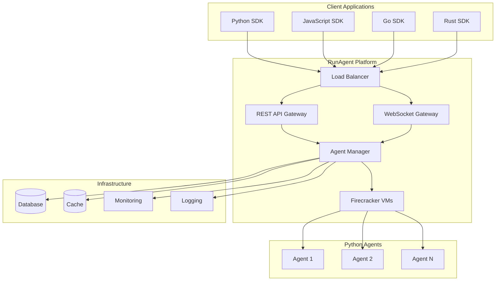
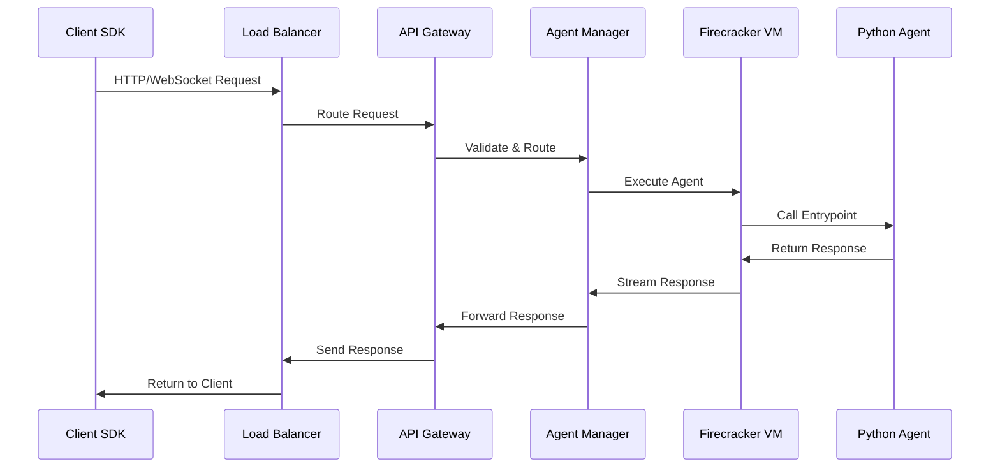
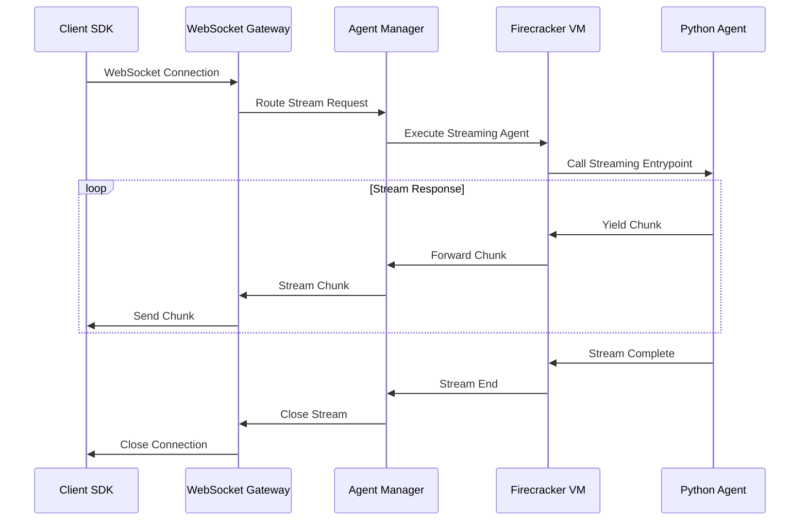
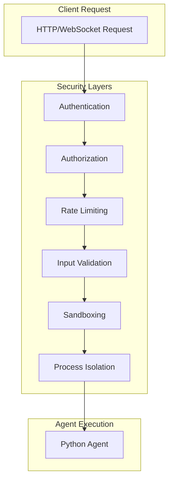
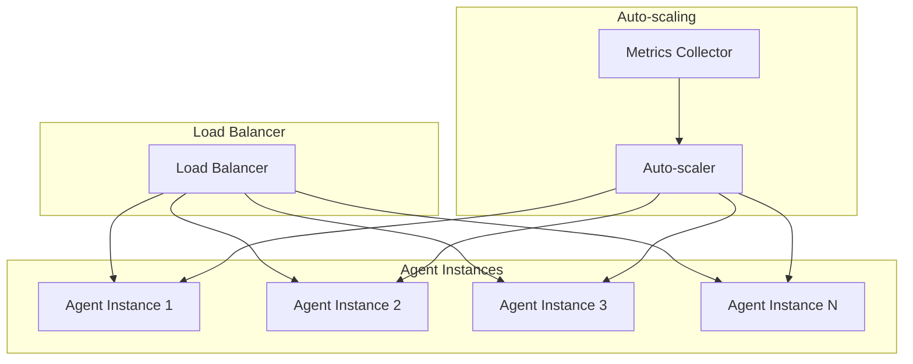
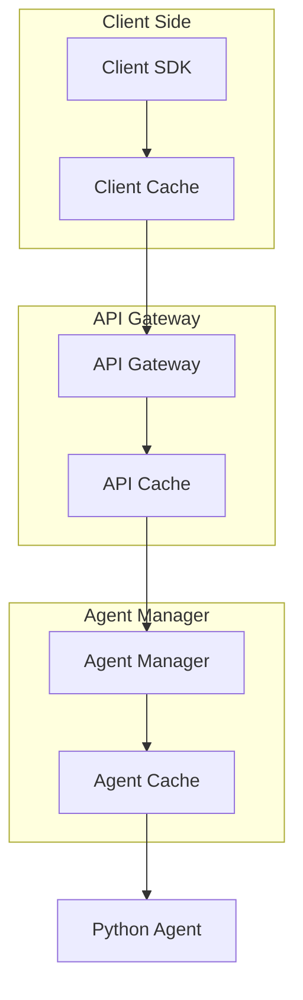
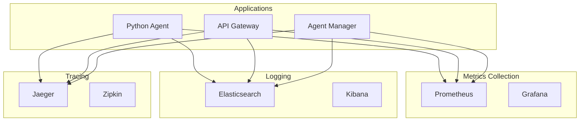
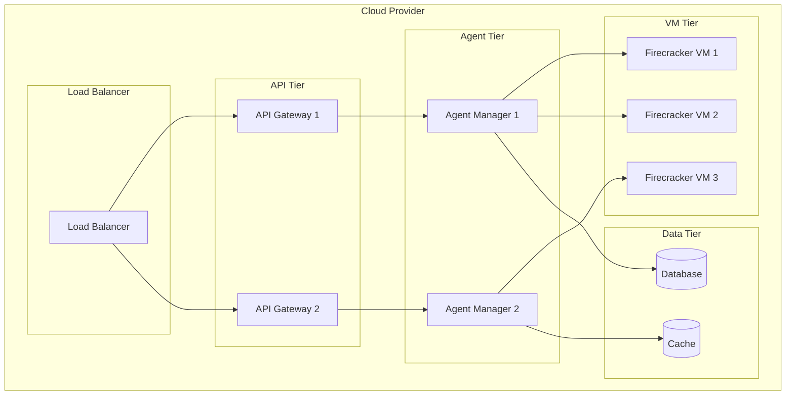
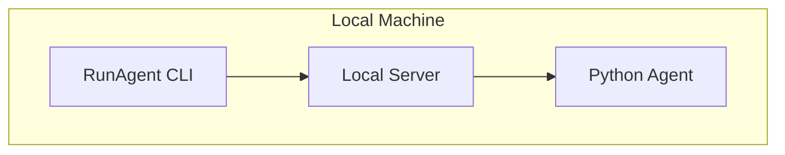
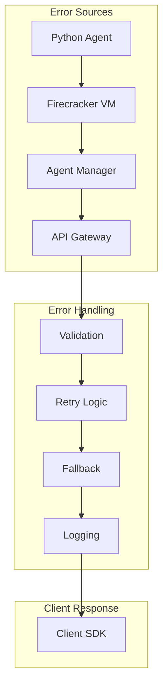

import NeedHelp from '/snippets/need-help.mdx';

<Info>
  **Prerequisites**: Understanding of [Core Concepts](/explanation/core-concepts) and basic knowledge of distributed systems
</Info>

## Overview

RunAgent is built on a modern, scalable architecture that enables Python-based AI agents to be accessed from any programming language. The system is designed for high performance, reliability, and ease of use.

## High-Level Architecture

## Core Components

### 1. **Client SDKs**

RunAgent provides native SDKs for multiple programming languages:

- **Python SDK**: Full-featured with sync/async support
- **JavaScript SDK**: TypeScript support with async/await
- **Go SDK**: Idiomatic Go with context-aware operations
- **Rust SDK**: High-performance with zero-cost abstractions

Each SDK provides:
- **Authentication**: API key management
- **Request/Response**: Synchronous and asynchronous calls
- **Streaming**: Real-time response streaming
- **Error Handling**: Language-appropriate error types
- **Retry Logic**: Automatic retry with backoff

### 2. **API Gateway**

The API Gateway handles:

- **Request Routing**: Routes requests to appropriate agents
- **Authentication**: Validates API keys and permissions
- **Rate Limiting**: Enforces rate limits per client
- **Load Balancing**: Distributes load across agent instances
- **Protocol Translation**: Converts between HTTP and WebSocket

### 3. **Agent Manager**

The Agent Manager is responsible for:

- **Agent Lifecycle**: Starting, stopping, and monitoring agents
- **Configuration Management**: Loading and validating configurations
- **Health Monitoring**: Checking agent health and availability
- **Scaling**: Automatically scaling agents based on demand
- **Resource Management**: Allocating and managing resources

### 4. **Firecracker MicroVMs**

RunAgent uses Firecracker for secure, isolated agent execution:

- **Security**: Each agent runs in its own microVM
- **Isolation**: Complete process and resource isolation
- **Performance**: Near-native performance with minimal overhead
- **Scalability**: Fast boot times and efficient resource usage
- **Sandboxing**: Secure execution environment

## Data Flow

### 1. **Request Processing**

### 2. **Streaming Response**

## Security Architecture

### 1. **Multi-Layer Security**

### 2. **Firecracker Security Model**

- **MicroVM Isolation**: Each agent runs in its own microVM
- **Resource Limits**: CPU, memory, and network constraints
- **File System**: Restricted file system access
- **Network**: Controlled network access
- **Process**: Complete process isolation

## Scalability Architecture

### 1. **Horizontal Scaling**

### 2. **Auto-scaling Triggers**

- **CPU Usage**: Scale up when CPU usage exceeds threshold
- **Memory Usage**: Scale up when memory usage is high
- **Request Rate**: Scale up when request rate increases
- **Response Time**: Scale up when response times are slow
- **Queue Length**: Scale up when request queue is long

## Performance Architecture

### 1. **Caching Strategy**

### 2. **Performance Optimizations**

- **Connection Pooling**: Reuse connections for efficiency
- **Request Batching**: Batch multiple requests together
- **Response Compression**: Compress responses to reduce bandwidth
- **CDN Integration**: Use CDN for static content
- **Database Optimization**: Optimize database queries and indexes

## Monitoring and Observability

### 1. **Monitoring Stack**

### 2. **Key Metrics**

- **Request Rate**: Requests per second
- **Response Time**: Average and P95 response times
- **Error Rate**: Percentage of failed requests
- **Resource Usage**: CPU, memory, and network usage
- **Agent Health**: Agent availability and performance

## Deployment Architecture

### 1. **Cloud Deployment**

### 2. **Local Development**

## Error Handling Architecture

### 1. **Error Propagation**

### 2. **Error Types**

- **Client Errors**: Authentication, validation, rate limiting
- **Server Errors**: Internal server errors, agent failures
- **Network Errors**: Connection timeouts, network issues
- **Agent Errors**: Python exceptions, function errors

## Future Architecture

### 1. **Planned Enhancements**

- **Multi-Region Deployment**: Global agent deployment
- **Edge Computing**: Deploy agents closer to users
- **GPU Support**: GPU-accelerated agent execution
- **Custom Runtimes**: Support for additional languages
- **Advanced Caching**: Intelligent response caching

### 2. **Scalability Improvements**

- **Kubernetes Integration**: Native Kubernetes support
- **Service Mesh**: Istio integration for advanced networking
- **Event-Driven Architecture**: Event-based agent communication
- **Stream Processing**: Real-time data processing capabilities

## Best Practices

### 1. **Agent Design**

- **Stateless**: Design agents to be stateless
- **Idempotent**: Make operations idempotent
- **Error Handling**: Implement proper error handling
- **Resource Management**: Manage resources efficiently
- **Monitoring**: Add appropriate logging and metrics

### 2. **Performance Optimization**

- **Caching**: Use caching for expensive operations
- **Streaming**: Use streaming for long-running operations
- **Batch Processing**: Batch multiple operations together
- **Resource Limits**: Set appropriate resource limits
- **Connection Pooling**: Use connection pooling

## Next Steps

<CardGroup cols={2}>
  <Card title="Production Considerations" icon="gauge" href="/explanation/production-considerations">
    Learn about production deployment requirements
  </Card>
  <Card title="Security" icon="shield" href="/explanation/security">
    Understand RunAgent's security model
  </Card>
  <Card title="Performance Tuning" icon="speed" href="/how-to/advanced-tasks">
    Learn advanced performance optimization techniques
  </Card>
  <Card title="Deployment" icon="cloud" href="/runagent-cloud/cloud-deployment">
    Deploy your agents to production
  </Card>
</CardGroup>

<Note>
**🎉 Excellent!** You now understand RunAgent's architecture and how it enables seamless multi-language AI agent deployment. This knowledge will help you build more effective agents and troubleshoot issues!
</Note>

<NeedHelp context="Architecture Overview" />
