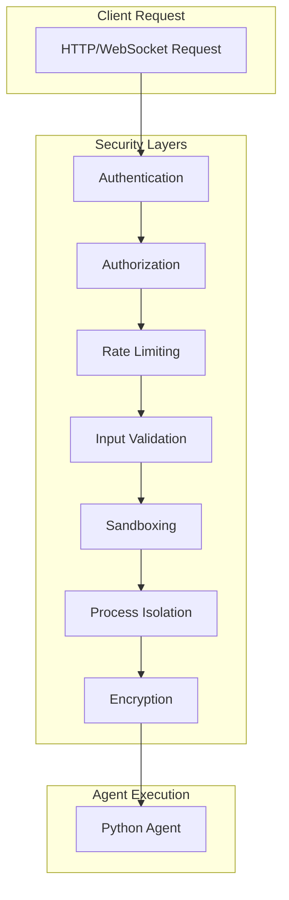

import NeedHelp from '/snippets/need-help.mdx';

<Info>
  **Prerequisites**: Understanding of [Core Concepts](/explanation/core-concepts) and [Architecture Overview](/explanation/architecture-overview)
</Info>

## Overview

RunAgent is designed with security as a fundamental principle. This guide covers RunAgent's security model, best practices, and how to secure your agents and data.

## Security Architecture

### 1. **Multi-Layer Security Model**



### 2. **Security Boundaries**

- **Network Boundary**: API Gateway with authentication and rate limiting
- **Process Boundary**: Firecracker microVMs with complete isolation
- **Data Boundary**: Encrypted data transmission and storage
- **Code Boundary**: Sandboxed execution environment

## Authentication and Authorization

### 1. **API Key Management**

#### API Key Structure
```python
import hashlib
import hmac
import time
from typing import Optional

class APIKeyManager:
    def __init__(self, secret_key: str):
        self.secret_key = secret_key
    
    def generate_key(self, user_id: str, permissions: List[str]) -> str:
        """Generate API key with permissions"""
        timestamp = int(time.time())
        message = f"{user_id}:{':'.join(permissions)}:{timestamp}"
        signature = hmac.new(
            self.secret_key.encode(),
            message.encode(),
            hashlib.sha256
        ).hexdigest()
        return f"{user_id}:{signature}:{timestamp}"
    
    def validate_key(self, api_key: str) -> Optional[Dict[str, Any]]:
        """Validate API key and return user info"""
        try:
            user_id, signature, timestamp = api_key.split(':')
            
            # Check if key is expired (24 hours)
            if time.time() - int(timestamp) > 86400:
                return None
            
            # Validate signature
            expected_message = f"{user_id}:{timestamp}"
            expected_signature = hmac.new(
                self.secret_key.encode(),
                expected_message.encode(),
                hashlib.sha256
            ).hexdigest()
            
            if hmac.compare_digest(signature, expected_signature):
                return {
                    'user_id': user_id,
                    'permissions': ['read', 'write'],  # Default permissions
                    'expires_at': int(timestamp) + 86400
                }
            
            return None
        except:
            return None
```

#### Role-Based Access Control
```python
from enum import Enum
from typing import List, Dict, Any

class Permission(Enum):
    READ = "read"
    WRITE = "write"
    ADMIN = "admin"
    STREAM = "stream"

class Role:
    def __init__(self, name: str, permissions: List[Permission]):
        self.name = name
        self.permissions = permissions
    
    def has_permission(self, permission: Permission) -> bool:
        return permission in self.permissions

class User:
    def __init__(self, user_id: str, role: Role):
        self.user_id = user_id
        self.role = role
    
    def can_access(self, permission: Permission) -> bool:
        return self.role.has_permission(permission)

# Define roles
ROLES = {
    'viewer': Role('viewer', [Permission.READ]),
    'user': Role('user', [Permission.READ, Permission.WRITE]),
    'admin': Role('admin', [Permission.READ, Permission.WRITE, Permission.ADMIN]),
    'streamer': Role('streamer', [Permission.READ, Permission.STREAM])
}
```

### 2. **OAuth 2.0 Integration**

#### OAuth Provider Integration
```python
import requests
from typing import Optional, Dict, Any

class OAuthProvider:
    def __init__(self, client_id: str, client_secret: str, provider_url: str):
        self.client_id = client_id
        self.client_secret = client_secret
        self.provider_url = provider_url
    
    def validate_token(self, access_token: str) -> Optional[Dict[str, Any]]:
        """Validate OAuth access token"""
        try:
            response = requests.get(
                f"{self.provider_url}/userinfo",
                headers={'Authorization': f'Bearer {access_token}'}
            )
            
            if response.status_code == 200:
                user_info = response.json()
                return {
                    'user_id': user_info.get('sub'),
                    'email': user_info.get('email'),
                    'name': user_info.get('name'),
                    'permissions': self._get_permissions(user_info)
                }
            
            return None
        except:
            return None
    
    def _get_permissions(self, user_info: Dict[str, Any]) -> List[str]:
        """Extract permissions from user info"""
        # Implementation depends on OAuth provider
        return ['read', 'write']
```

## Input Validation and Sanitization

### 1. **Comprehensive Input Validation**

```python
import re
import json
from typing import Dict, Any, List, Optional
from dataclasses import dataclass

@dataclass
class ValidationRule:
    field: str
    required: bool = False
    max_length: Optional[int] = None
    pattern: Optional[str] = None
    data_type: type = str

class InputValidator:
    def __init__(self, rules: List[ValidationRule]):
        self.rules = {rule.field: rule for rule in rules}
    
    def validate(self, data: Dict[str, Any]) -> Dict[str, Any]:
        """Validate input data against rules"""
        errors = []
        sanitized_data = {}
        
        for field, rule in self.rules.items():
            value = data.get(field)
            
            # Check required fields
            if rule.required and value is None:
                errors.append(f"Required field '{field}' is missing")
                continue
            
            if value is None:
                continue
            
            # Check data type
            if not isinstance(value, rule.data_type):
                errors.append(f"Field '{field}' must be of type {rule.data_type.__name__}")
                continue
            
            # Check max length
            if rule.max_length and len(str(value)) > rule.max_length:
                errors.append(f"Field '{field}' exceeds maximum length of {rule.max_length}")
                continue
            
            # Check pattern
            if rule.pattern and not re.match(rule.pattern, str(value)):
                errors.append(f"Field '{field}' does not match required pattern")
                continue
            
            # Sanitize value
            sanitized_value = self._sanitize_value(value, rule.data_type)
            sanitized_data[field] = sanitized_value
        
        if errors:
            return {
                'valid': False,
                'errors': errors,
                'data': None
            }
        
        return {
            'valid': True,
            'errors': [],
            'data': sanitized_data
        }
    
    def _sanitize_value(self, value: Any, data_type: type) -> Any:
        """Sanitize value based on data type"""
        if data_type == str:
            # Remove potentially dangerous characters
            return re.sub(r'[<>"\']', '', str(value))
        elif data_type == int:
            return int(value)
        elif data_type == float:
            return float(value)
        elif data_type == bool:
            return bool(value)
        else:
            return value

# Define validation rules
VALIDATION_RULES = [
    ValidationRule('message', required=True, max_length=10000),
    ValidationRule('user_id', required=True, pattern=r'^[a-zA-Z0-9_-]+$'),
    ValidationRule('context', required=False, data_type=dict),
    ValidationRule('stream', required=False, data_type=bool)
]
```

### 2. **SQL Injection Prevention**

```python
import sqlite3
from typing import List, Dict, Any

class SecureDatabase:
    def __init__(self, db_path: str):
        self.db_path = db_path
    
    def execute_query(self, query: str, params: tuple = ()) -> List[Dict[str, Any]]:
        """Execute query with parameterized statements"""
        with sqlite3.connect(self.db_path) as conn:
            conn.row_factory = sqlite3.Row
            cursor = conn.cursor()
            cursor.execute(query, params)
            return [dict(row) for row in cursor.fetchall()]
    
    def get_user_data(self, user_id: str) -> List[Dict[str, Any]]:
        """Get user data safely"""
        # Use parameterized query to prevent SQL injection
        query = "SELECT * FROM users WHERE user_id = ?"
        return self.execute_query(query, (user_id,))
```

### 3. **XSS Prevention**

```python
import html
import re
from typing import str

class XSSPrevention:
    @staticmethod
    def sanitize_html(text: str) -> str:
        """Sanitize HTML to prevent XSS"""
        # Escape HTML characters
        sanitized = html.escape(text)
        
        # Remove script tags
        sanitized = re.sub(r'<script.*?</script>', '', sanitized, flags=re.DOTALL)
        
        # Remove javascript: URLs
        sanitized = re.sub(r'javascript:', '', sanitized, flags=re.IGNORECASE)
        
        return sanitized
    
    @staticmethod
    def validate_url(url: str) -> bool:
        """Validate URL to prevent malicious redirects"""
        # Only allow http and https protocols
        if not re.match(r'^https?://', url):
            return False
        
        # Check for suspicious patterns
        suspicious_patterns = [
            r'javascript:',
            r'data:',
            r'vbscript:',
            r'file:'
        ]
        
        for pattern in suspicious_patterns:
            if re.search(pattern, url, re.IGNORECASE):
                return False
        
        return True
```

## Data Encryption

### 1. **Data in Transit**

#### TLS/SSL Configuration
```python
import ssl
from typing import Dict, Any

class TLSConfig:
    def __init__(self):
        self.ssl_context = ssl.create_default_context()
        self.ssl_context.check_hostname = True
        self.ssl_context.verify_mode = ssl.CERT_REQUIRED
    
    def get_secure_context(self) -> ssl.SSLContext:
        """Get secure SSL context"""
        return self.ssl_context
    
    def configure_ciphers(self, ciphers: List[str]):
        """Configure allowed ciphers"""
        self.ssl_context.set_ciphers(':'.join(ciphers))
    
    def set_certificate(self, cert_file: str, key_file: str):
        """Set certificate and key files"""
        self.ssl_context.load_cert_chain(cert_file, key_file)
```

### 2. **Data at Rest**

#### Encryption for Sensitive Data
```python
from cryptography.fernet import Fernet
from cryptography.hazmat.primitives import hashes
from cryptography.hazmat.primitives.kdf.pbkdf2 import PBKDF2HMAC
import base64
import os

class DataEncryption:
    def __init__(self, password: str):
        self.key = self._derive_key(password)
        self.cipher = Fernet(self.key)
    
    def _derive_key(self, password: str) -> bytes:
        """Derive encryption key from password"""
        salt = os.urandom(16)
        kdf = PBKDF2HMAC(
            algorithm=hashes.SHA256(),
            length=32,
            salt=salt,
            iterations=100000,
        )
        key = base64.urlsafe_b64encode(kdf.derive(password.encode()))
        return key
    
    def encrypt(self, data: str) -> str:
        """Encrypt sensitive data"""
        encrypted = self.cipher.encrypt(data.encode())
        return base64.b64encode(encrypted).decode()
    
    def decrypt(self, encrypted_data: str) -> str:
        """Decrypt sensitive data"""
        encrypted = base64.b64decode(encrypted_data.encode())
        return self.cipher.decrypt(encrypted).decode()
```

## Sandboxing and Isolation

### 1. **Firecracker Security Model**

#### Resource Limits
```python
from typing import Dict, Any

class ResourceLimits:
    def __init__(self):
        self.limits = {
            'cpu_quota': 100000,  # CPU quota in microseconds
            'memory_limit': 512 * 1024 * 1024,  # 512MB memory limit
            'disk_limit': 1024 * 1024 * 1024,  # 1GB disk limit
            'network_bandwidth': 10 * 1024 * 1024,  # 10MB/s network limit
            'max_processes': 100,
            'max_file_descriptors': 1024
        }
    
    def get_limits(self) -> Dict[str, Any]:
        """Get resource limits for agent"""
        return self.limits
    
    def apply_limits(self, agent_id: str):
        """Apply resource limits to agent"""
        # Implementation would apply limits to Firecracker VM
        pass
```

#### Network Isolation
```python
class NetworkIsolation:
    def __init__(self):
        self.allowed_hosts = [
            'api.openai.com',
            'api.anthropic.com',
            'api.cohere.ai'
        ]
        self.blocked_ports = [22, 23, 25, 53, 80, 443, 993, 995]
    
    def is_allowed_host(self, host: str) -> bool:
        """Check if host is allowed"""
        return host in self.allowed_hosts
    
    def is_allowed_port(self, port: int) -> bool:
        """Check if port is allowed"""
        return port not in self.blocked_ports
    
    def create_network_policy(self, agent_id: str) -> Dict[str, Any]:
        """Create network policy for agent"""
        return {
            'agent_id': agent_id,
            'allowed_hosts': self.allowed_hosts,
            'blocked_ports': self.blocked_ports,
            'max_connections': 10
        }
```

### 2. **Process Isolation**

#### Sandbox Configuration
```python
import subprocess
from typing import List, Dict, Any

class SandboxConfig:
    def __init__(self):
        self.restrictions = {
            'no_network': False,
            'no_file_system': False,
            'no_process_creation': True,
            'no_system_calls': True,
            'read_only_root': True
        }
    
    def create_sandbox(self, agent_id: str) -> Dict[str, Any]:
        """Create sandbox configuration for agent"""
        return {
            'agent_id': agent_id,
            'restrictions': self.restrictions,
            'working_directory': f'/tmp/agent_{agent_id}',
            'environment_variables': {
                'PATH': '/usr/local/bin:/usr/bin:/bin',
                'HOME': f'/tmp/agent_{agent_id}'
            }
        }
    
    def execute_in_sandbox(self, command: List[str], sandbox_config: Dict[str, Any]) -> subprocess.CompletedProcess:
        """Execute command in sandbox"""
        # Implementation would use Firecracker or similar
        pass
```

## Rate Limiting and DDoS Protection

### 1. **Rate Limiting Implementation**

```python
import time
from typing import Dict, Any
from collections import defaultdict, deque

class RateLimiter:
    def __init__(self, max_requests: int = 100, window_seconds: int = 60):
        self.max_requests = max_requests
        self.window_seconds = window_seconds
        self.requests = defaultdict(deque)
    
    def is_allowed(self, client_id: str) -> bool:
        """Check if client is within rate limit"""
        now = time.time()
        client_requests = self.requests[client_id]
        
        # Remove old requests outside window
        while client_requests and client_requests[0] <= now - self.window_seconds:
            client_requests.popleft()
        
        # Check if under limit
        if len(client_requests) < self.max_requests:
            client_requests.append(now)
            return True
        
        return False
    
    def get_remaining_requests(self, client_id: str) -> int:
        """Get remaining requests for client"""
        now = time.time()
        client_requests = self.requests[client_id]
        
        # Remove old requests
        while client_requests and client_requests[0] <= now - self.window_seconds:
            client_requests.popleft()
        
        return max(0, self.max_requests - len(client_requests))
```

### 2. **DDoS Protection**

```python
class DDoSProtection:
    def __init__(self):
        self.suspicious_ips = set()
        self.blocked_ips = set()
        self.request_counts = defaultdict(int)
        self.last_reset = time.time()
    
    def check_request(self, ip: str, user_agent: str) -> bool:
        """Check if request should be allowed"""
        now = time.time()
        
        # Reset counters every minute
        if now - self.last_reset > 60:
            self.request_counts.clear()
            self.last_reset = now
        
        # Check if IP is blocked
        if ip in self.blocked_ips:
            return False
        
        # Count requests from this IP
        self.request_counts[ip] += 1
        
        # Check for suspicious patterns
        if self._is_suspicious(ip, user_agent):
            self.suspicious_ips.add(ip)
            return False
        
        # Block IP if too many requests
        if self.request_counts[ip] > 1000:  # 1000 requests per minute
            self.blocked_ips.add(ip)
            return False
        
        return True
    
    def _is_suspicious(self, ip: str, user_agent: str) -> bool:
        """Check for suspicious request patterns"""
        # Check for common bot patterns
        bot_patterns = [
            'python-requests',
            'curl',
            'wget',
            'bot',
            'crawler'
        ]
        
        for pattern in bot_patterns:
            if pattern.lower() in user_agent.lower():
                return True
        
        return False
```

## Security Monitoring

### 1. **Security Event Logging**

```python
import logging
import json
from datetime import datetime
from typing import Dict, Any

class SecurityLogger:
    def __init__(self):
        self.logger = logging.getLogger('security')
        self.logger.setLevel(logging.INFO)
        
        # Configure security log handler
        handler = logging.FileHandler('security.log')
        formatter = logging.Formatter('%(message)s')
        handler.setFormatter(formatter)
        self.logger.addHandler(handler)
    
    def log_auth_failure(self, ip: str, user_id: str, reason: str):
        """Log authentication failure"""
        self.logger.warning(json.dumps({
            'timestamp': datetime.utcnow().isoformat(),
            'event': 'auth_failure',
            'ip': ip,
            'user_id': user_id,
            'reason': reason
        }))
    
    def log_rate_limit_exceeded(self, ip: str, user_id: str, limit: int):
        """Log rate limit exceeded"""
        self.logger.warning(json.dumps({
            'timestamp': datetime.utcnow().isoformat(),
            'event': 'rate_limit_exceeded',
            'ip': ip,
            'user_id': user_id,
            'limit': limit
        }))
    
    def log_suspicious_activity(self, ip: str, activity: str, details: Dict[str, Any]):
        """Log suspicious activity"""
        self.logger.error(json.dumps({
            'timestamp': datetime.utcnow().isoformat(),
            'event': 'suspicious_activity',
            'ip': ip,
            'activity': activity,
            'details': details
        }))
```

### 2. **Security Alerts**

```python
class SecurityAlertManager:
    def __init__(self):
        self.alert_thresholds = {
            'auth_failures': 10,  # 10 failures per minute
            'rate_limit_exceeded': 5,  # 5 rate limit violations per minute
            'suspicious_activity': 3  # 3 suspicious activities per minute
        }
        self.alert_counts = defaultdict(int)
        self.last_reset = time.time()
    
    def check_alerts(self, event_type: str, ip: str):
        """Check if alert should be triggered"""
        now = time.time()
        
        # Reset counters every minute
        if now - self.last_reset > 60:
            self.alert_counts.clear()
            self.last_reset = now
        
        # Count events
        key = f"{event_type}:{ip}"
        self.alert_counts[key] += 1
        
        # Check threshold
        if self.alert_counts[key] >= self.alert_thresholds.get(event_type, 0):
            self._send_alert(event_type, ip, self.alert_counts[key])
    
    def _send_alert(self, event_type: str, ip: str, count: int):
        """Send security alert"""
        # Implementation would send alert via email, Slack, etc.
        print(f"SECURITY ALERT: {event_type} from {ip} ({count} occurrences)")
```

## Compliance and Auditing

### 1. **Audit Trail**

```python
class AuditTrail:
    def __init__(self):
        self.audit_log = []
    
    def log_action(self, user_id: str, action: str, resource: str, details: Dict[str, Any]):
        """Log user action for auditing"""
        audit_entry = {
            'timestamp': datetime.utcnow().isoformat(),
            'user_id': user_id,
            'action': action,
            'resource': resource,
            'details': details,
            'ip_address': self._get_client_ip(),
            'user_agent': self._get_user_agent()
        }
        self.audit_log.append(audit_entry)
    
    def get_audit_log(self, user_id: str = None, start_date: str = None, end_date: str = None) -> List[Dict[str, Any]]:
        """Get audit log with optional filters"""
        filtered_log = self.audit_log
        
        if user_id:
            filtered_log = [entry for entry in filtered_log if entry['user_id'] == user_id]
        
        if start_date:
            filtered_log = [entry for entry in filtered_log if entry['timestamp'] >= start_date]
        
        if end_date:
            filtered_log = [entry for entry in filtered_log if entry['timestamp'] <= end_date]
        
        return filtered_log
```

### 2. **Data Retention Policy**

```python
class DataRetentionManager:
    def __init__(self, retention_days: int = 90):
        self.retention_days = retention_days
    
    def should_retain(self, timestamp: str) -> bool:
        """Check if data should be retained"""
        data_time = datetime.fromisoformat(timestamp)
        cutoff_time = datetime.utcnow() - timedelta(days=self.retention_days)
        return data_time > cutoff_time
    
    def cleanup_old_data(self, data: List[Dict[str, Any]]) -> List[Dict[str, Any]]:
        """Remove old data based on retention policy"""
        return [entry for entry in data if self.should_retain(entry['timestamp'])]
```

## Security Best Practices

### 1. **Agent Development**

```python
# Secure agent development practices
def secure_agent(data: Dict[str, Any]) -> Dict[str, Any]:
    """Example of secure agent implementation"""
    
    # 1. Validate input
    validator = InputValidator(VALIDATION_RULES)
    validation_result = validator.validate(data)
    
    if not validation_result['valid']:
        return {
            'error': 'Invalid input',
            'details': validation_result['errors']
        }
    
    # 2. Sanitize data
    sanitized_data = validation_result['data']
    
    # 3. Process data securely
    try:
        result = process_data_securely(sanitized_data)
        
        # 4. Log action
        audit_trail.log_action(
            user_id=sanitized_data['user_id'],
            action='agent_execution',
            resource='data_processing',
            details={'input_size': len(sanitized_data['message'])}
        )
        
        return {
            'result': result,
            'status': 'success'
        }
    
    except Exception as e:
        # 5. Log error securely
        security_logger.log_suspicious_activity(
            ip=get_client_ip(),
            activity='agent_error',
            details={'error': str(e)}
        )
        
        return {
            'error': 'Processing failed',
            'status': 'error'
        }
```

### 2. **Configuration Security**

```python
# Secure configuration management
class SecureConfig:
    def __init__(self):
        self.config = self._load_secure_config()
    
    def _load_secure_config(self) -> Dict[str, Any]:
        """Load configuration securely"""
        return {
            'api_key': os.getenv('RUNAGENT_API_KEY'),
            'database_url': os.getenv('DATABASE_URL'),
            'encryption_key': os.getenv('ENCRYPTION_KEY'),
            'jwt_secret': os.getenv('JWT_SECRET')
        }
    
    def get_config(self, key: str) -> str:
        """Get configuration value securely"""
        if key not in self.config:
            raise ValueError(f"Configuration key '{key}' not found")
        
        return self.config[key]
```

## Next Steps

<CardGroup cols={2}>
  <Card title="Production Considerations" icon="gauge" href="/explanation/production-considerations">
    Learn about production security requirements
  </Card>
  <Card title="Architecture Overview" icon="diagram" href="/explanation/architecture-overview">
    Understand RunAgent's security architecture
  </Card>
  <Card title="Advanced Tasks" icon="cog" href="/how-to/advanced-tasks">
    Learn advanced security patterns
  </Card>
  <Card title="Compliance" icon="shield-check" href="/how-to/advanced-tasks">
    Understand compliance requirements
  </Card>
</CardGroup>

<Note>
**🎉 Excellent!** You now understand RunAgent's security model and best practices. These security measures help protect your agents, data, and users from various threats!
</Note>

<NeedHelp context="Security" />
