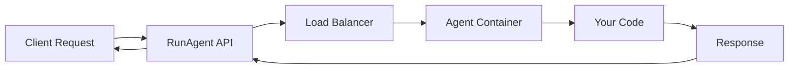

## Overview

RunAgent is built on several core concepts that make it powerful yet simple to use. Understanding these concepts will help you build better agents and use the platform effectively.

## Agents

An **agent** in RunAgent is a deployable AI application that:
- Processes inputs and returns outputs
- Can use tools and external APIs
- Maintains state across interactions
- Runs in a secure, isolated environment

### Agent Lifecycle

<Steps>
  <Step title="Development">
    Write and test your agent code locally
  </Step>
  <Step title="Configuration">
    Define how RunAgent should interact with your code
  </Step>
  <Step title="Deployment">
    Upload and run your agent on RunAgent infrastructure
  </Step>
  <Step title="Execution">
    Invoke your agent via API, SDK, or CLI
  </Step>
</Steps>

## Entrypoints

**Entrypoints** are the functions RunAgent calls to interact with your agent:

```python
# Example entrypoint
def process_request(input_data: dict) -> dict:
    # Your agent logic here
    return {"result": "processed"}
```

### Types of Entrypoints

| Type | Purpose | Input | Output |
|------|---------|-------|--------|
| `generic` | Standard request/response | Dict | Dict |
| `generic_stream` | Streaming responses | Dict | Generator[str] |
| `async` | Asynchronous processing | Dict | Awaitable[Dict] |
| `batch` | Batch processing | List[Dict] | List[Dict] |

## Configuration

The `runagent.config.json` file is the contract between your code and RunAgent:

```json
{
  "agent_name": "my-agent",
  "framework": "langgraph",
  "agent_architecture": {
    "entrypoints": [
      {
        "file": "agent.py",
        "module": "app.invoke",
        "type": "generic"
      }
    ]
  }
}
```

### Key Configuration Elements

<CardGroup cols={2}>
  <Card title="Agent Metadata" icon="tag">
    Name, version, description, and framework
  </Card>
  <Card title="Entrypoints" icon="door-open">
    How RunAgent calls your code
  </Card>
  <Card title="Environment" icon="globe">
    Variables and secrets management
  </Card>
  <Card title="Resources" icon="cpu">
    Memory, CPU, and timeout settings
  </Card>
</CardGroup>

## Frameworks

RunAgent supports multiple AI frameworks:

<Tabs>
  <Tab title="LangGraph">
    ```python
    from langgraph import StateGraph
    
    # Your LangGraph agent
    app = StateGraph(...)
    ```
  </Tab>
  <Tab title="CrewAI">
    ```python
    from crewai import Crew
    
    # Your CrewAI agents
    crew = Crew(...)
    ```
  </Tab>
  <Tab title="Custom">
    ```python
    # Any Python code
    def my_agent(input):
        # Your logic
        return output
    ```
  </Tab>
</Tabs>

## Execution Modes

### Local Development

```bash
runagent serve .
```
- Runs on your machine
- Hot reload support
- Direct access to logs
- Perfect for testing

### Production Deployment

```bash
runagent deploy .
```
- Runs on RunAgent infrastructure
- Automatic scaling
- Monitoring and logging
- High availability

## Security Model

<AccordionGroup>
  <Accordion title="Sandboxed Execution">
    Each agent runs in an isolated environment with:
    - Resource limits
    - Network restrictions
    - File system isolation
  </Accordion>
  
  <Accordion title="Secrets Management">
    Environment variables are:
    - Encrypted at rest
    - Injected at runtime
    - Never exposed in logs
  </Accordion>
  
  <Accordion title="API Authentication">
    All API calls require:
    - Valid API keys
    - Request signing
    - Rate limiting
  </Accordion>
</AccordionGroup>

## Data Flow

Understanding how data flows through RunAgent:



## Best Practices

### Agent Design

1. **Stateless when possible**: Design agents to be stateless for better scaling
2. **Idempotent operations**: Same input should produce same output
3. **Error handling**: Always handle and return meaningful errors
4. **Timeout awareness**: Respect execution time limits

### Resource Usage

```python
# Good: Efficient processing
def process(data):
    # Process only what's needed
    result = quick_operation(data)
    return result

# Bad: Resource intensive
def process(data):
    # Loading large models repeatedly
    model = load_huge_model()  # ❌
    return model.process(data)
```

### Security

- Never hardcode secrets
- Validate all inputs
- Sanitize outputs
- Use least privilege principle

## Common Patterns

### Request-Response Pattern

```python
def handle_request(input_data: dict) -> dict:
    try:
        # Validate input
        validate_input(input_data)
        
        # Process
        result = process_data(input_data)
        
        # Return structured response
        return {
            "status": "success",
            "data": result
        }
    except Exception as e:
        return {
            "status": "error",
            "message": str(e)
        }
```

### Streaming Pattern

```python
def stream_response(input_data: dict):
    # Initial processing
    context = prepare_context(input_data)
    
    # Stream chunks
    for chunk in generate_response(context):
        yield chunk
```

### Tool Usage Pattern

```python
class AgentWithTools:
    def __init__(self):
        self.tools = {
            "search": self.search_tool,
            "calculate": self.calculate_tool
        }
    
    def process(self, input_data: dict) -> dict:
        tool_name = input_data.get("tool")
        if tool_name in self.tools:
            return self.tools[tool_name](input_data)
```

## Next Steps

Now that you understand the core concepts:

<CardGroup cols={2}>
  <Card title="Build Your First Agent" icon="hammer" href="/get-started/first-agent">
    Create a custom agent from scratch
  </Card>
  <Card title="Explore CLI" icon="terminal" href="/cli/overview">
    Master the command-line interface
  </Card>
</CardGroup>