<Info>
  **TL;DR**: RunAgent turns your Python AI agents into multi-language APIs with zero infrastructure headaches. Write once in Python, use everywhere.
</Info>

## The "Aha!" Moment: Why RunAgent Exists

Picture this: You've built an amazing LangGraph agent in Python. It works perfectly. Now your frontend team (JavaScript), your systems team (Rust), and your mobile team (Go) all want to use it. 

**The old way:**
- Build REST APIs manually
- Handle streaming responses with WebSockets
- Manage authentication and error handling
- Duplicate logic across languages
- Deploy and scale infrastructure yourself

**The RunAgent way:**
```python
# Your Python agent stays exactly as it is
def my_agent(query: str) -> str:
    return langgraph_agent.invoke(query)
```

```javascript
// Your JavaScript team uses it natively
const result = await client.run({ query: "Hello!" });
```

```rust
// Your Rust team gets the same experience
let result = client.run(&[("query", json!("Hello!"))]).await?;
```
```go 
// Run the Go agent
result, err := agentClient.Run(ctx, map[string]interface{}{
	"query": "Hello!",
	})
```
That's the magic ✨

## Understanding Agents in RunAgent

An **agent** in RunAgent isn't just code—it's a complete, deployable AI application that can:

<CardGroup cols={2}>
  <Card title="Process Intelligently" icon="brain">
    Handle complex reasoning, tool use, and multi-step workflows
  </Card>
  <Card title="Scale Automatically" icon="chart-line">
    From single requests to thousands of concurrent users
  </Card>
  <Card title="Stream Responses" icon="stream">
    Real-time output for interactive experiences
  </Card>
  <Card title="Stay Secure" icon="shield">
    Isolated execution with secrets management
  </Card>
</CardGroup>

### The Agent Lifecycle: From Code to Production

```mermaid
graph TD
    A[💻 Write Python Agent] --> B[⚙️ Define Entrypoints]
    B --> C[🏠 Test Locally]
    C --> D[🚀 Deploy to Production]
    D --> E[🌍 Access from Any Language]
    
    style A fill:#e1f5fe
    style E fill:#e8f5e8
```



## Entrypoints: The Heart of RunAgent

Here's where RunAgent gets interesting. **Entrypoints** are your gateway from the outside world into your Python agent logic.

### The Magic of Function Mapping

Think of entrypoints as universal translators:

<CodeGroup>
```python Your Python Function
def solve_problem(question: str, difficulty: str = "medium") -> str:
    """Your agent logic here"""
    return langgraph_agent.invoke({
        "question": question,
        "difficulty": difficulty
    })
```

```javascript Becomes JavaScript
const result = await client.run({
  question: "How do quantum computers work?",
  difficulty: "beginner"
});
```

```rust And Rust
let result = client.run(&[
    ("question", json!("How do quantum computers work?")),
    ("difficulty", json!("beginner"))
]).await?;
```

```go Another one Go
result, err := agentClient.Run(ctx, map[string]interface{}{
	"question": "How do quantum computers work?",
  "difficulty": "beginner",
	})
```
</CodeGroup>

### Entrypoint Types: Choose Your Adventure

| Type | When to Use | Input/Output | Best For |
|------|-------------|--------------|----------|
| **Standard** | Most use cases | `dict → dict` | Chat, analysis, processing |
| **Streaming** | Real-time responses | `dict → Iterator[str]` | Long-form generation, live updates |
| **Custom** | Your exact function | `your_params → your_return` | Maximum flexibility |

<Note>
**Pro Tip**: Streaming entrypoints must have tags ending with `_stream`. This tells RunAgent to handle real-time data flow differently.
</Note>

### Streaming: The Real-Time Superpower

Here's what makes RunAgent's streaming special:

```python
def generate_story(prompt: str, style: str) -> Iterator[str]:
    """Stream a story as it's being generated"""
    for chunk in llm.stream(f"Write a {style} story about: {prompt}"):
        yield chunk.content
```

**What happens behind the scenes:**


**The beautiful part?** Your JavaScript, Rust, or Go client receives these chunks in real-time, exactly as if the function was running locally in their language.

## Configuration: Your Agent's Blueprint

The `runagent.config.json` file is where the magic happens. It's the contract between your Python code and the outside world:

```json
{
  "agent_name": "problem-solver",
  "description": "Solves complex problems with reasoning",
  "framework": "langgraph",
  "version": "1.0.0",
  "agent_architecture": {
    "entrypoints": [
      {
        "file": "agent.py",
        "module": "solve_problem",
        "tag": "solve"
      },
      {
        "file": "agent.py", 
        "module": "generate_story",
        "tag": "story_stream"
      }
    ]
  },
  "env_vars": {
    "OPENAI_API_KEY": "${OPENAI_API_KEY}",
    "CUSTOM_SETTING": "production"
  }
}
```

### Breaking Down the Configuration

<Tabs>
  <Tab title="Entrypoints">
    The bridges between your Python functions and external access:
    - **file**: Where your function lives
    - **module**: The exact function name
    - **tag**: What others use to call it (like a nickname)
  </Tab>
  
  <Tab title="Environment">
    Secure way to pass secrets and settings:
    - Uses environment variable substitution
    - Never exposed in logs or responses
    - Available to your agent at runtime
  </Tab>
  
  <Tab title="Metadata">
    Information about your agent:
    - Helps with versioning and tracking
    - Used for monitoring and debugging
    - Supports team collaboration
  </Tab>
</Tabs>

## Multi-Language SDK Magic

This is where RunAgent truly shines. Here's what happens when you call your agent from different languages:

### The Universal Translation Layer


### Language-Native Experience

Each SDK provides idiomatic experiences:

<Tabs>
  <Tab title="Python: Pythonic">
    ```python
    # Feels like calling a local function
    client = RunAgentClient(agent_id="agent_123", tag="solve")
    
    result = client.run(
        question="Explain relativity",
        difficulty="intermediate"
    )
    
    # Streaming feels natural too
    for chunk in client.run_stream(prompt="Write a poem"):
        print(chunk, end="")
    ```
  </Tab>
  
  <Tab title="JavaScript: Promise-Based">
    ```javascript
    // Modern async/await patterns
    const client = new RunAgentClient({
      agentId: "agent_123",
      tag: "solve"
    });
    
    const result = await client.run({
      question: "Explain relativity",
      difficulty: "intermediate"
    });
    
    // Streaming with async iterators
    for await (const chunk of client.runStream({prompt: "Write a poem"})) {
      process.stdout.write(chunk);
    }
    ```
  </Tab>
  
  <Tab title="Rust: High-Performance">
    ```rust
    // Zero-copy, high-performance streaming
    let client = RunAgentClient::new("agent_123", "solve", true).await?;
    
    let result = client.run(&[
        ("question", json!("Explain relativity")),
        ("difficulty", json!("intermediate"))
    ]).await?;
    
    // Efficient streaming with futures
    let mut stream = client.run_stream(&[
        ("prompt", json!("Write a poem"))
    ]).await?;
    
    while let Some(chunk) = stream.next().await {
        print!("{}", chunk?);
    }
    ```
  </Tab>

  <Tab title="Go: Iterator ">
    ```go
    c, err := client.NewWithAddress("841debad-7433-46ae-a0ec-0540d0df7314", "minimal_stream", true, "localhost", 8450)
	if err != nil {
		log.Fatal(err)
	}
	defer c.Close()

	ctx, cancel := context.WithTimeout(context.Background(), 2*time.Minute)
	defer cancel()

	s, err := c.RunStream(ctx, map[string]interface{}{"role": "user", "message": "Analyze the benefits of remote work for software teams"})
	if err != nil {
		log.Fatal(err)
	}
	defer s.Close()

	for {
		data, hasMore, err := s.Next(ctx)
		if err != nil {
			log.Fatal(err)
		}
		if !hasMore {
			break
		}
		fmt.Printf("Received: %v\n", data)
	}
    ```
  </Tab>
</Tabs>

## Execution Modes: Local to Global

### Local Development: Your Playground

```bash
runagent serve .
```

**What this gives you:**
- 🔄 **Hot reload**: Changes reflect immediately
- 📊 **Direct logging**: See everything in your terminal
- 🐛 **Easy debugging**: Step through code normally
- ⚡ **Fast iteration**: No deployment overhead

Perfect for development, testing, and experimentation.

### Production Deployment: Scale Without Limits

```bash
runagent deploy .  # Coming soon
```

**What production unlocks:**
- 🚀 **Auto-scaling**: Handle 1 or 1,000,000 requests
- 🔒 **Security**: Sandboxed, isolated execution
- 📈 **Monitoring**: Real-time metrics and logging
- 🌍 **Global**: Deploy close to your users

## Framework Freedom: Bring Your Own AI

RunAgent doesn't care what AI framework you use. If it's Python, it works:

<Tabs>
  <Tab title="LangGraph">
    ```python
    from langgraph import StateGraph
    
    # Your complex multi-agent workflow
    workflow = StateGraph(AgentState)
    workflow.add_node("analyzer", analyze_node)
    workflow.add_node("researcher", research_node)
    
    app = workflow.compile()
    
    def process_query(query: str) -> dict:
        return app.invoke({"query": query})
    ```
  </Tab>
  
  <Tab title="CrewAI">
    ```python
    from crewai import Crew, Agent, Task
    
    # Your specialized agent crew
    researcher = Agent(role="Research Specialist", goal="...")
    writer = Agent(role="Content Writer", goal="...")
    
    crew = Crew(agents=[researcher, writer], tasks=[...])
    
    def run_crew(topic: str) -> str:
        return crew.kickoff(inputs={"topic": topic})
    ```
  </Tab>
  
  <Tab title="OpenAI">
    ```python
    from openai import OpenAI
    
    client = OpenAI()
    
    def chat_complete(message: str) -> str:
        response = client.chat.completions.create(
            model="gpt-4",
            messages=[{"role": "user", "content": message}]
        )
        return response.choices[0].message.content
    ```
  </Tab>
  
  <Tab title="Custom">
    ```python
    # Your custom ML pipeline
    def custom_agent(input_data: dict) -> dict:
        # Load your models
        # Run inference
        # Post-process results
        return {"result": "whatever you want"}
    ```
  </Tab>
</Tabs>

## The Communication Layer: How It All Works

Under the hood, RunAgent handles the complex networking so you don't have to:

### Request Flow


**Key insight**: You write normal Python functions. RunAgent automatically handles:
- HTTP/WebSocket protocol management
- Request/response serialization
- Error handling and retries
- Connection pooling and load balancing

## Security & Isolation: Production-Ready by Default

<AccordionGroup>
  <Accordion title="🔒 Sandboxed Execution">
    Each agent runs in complete isolation:
    - **Memory limits**: Prevent resource exhaustion
    - **Network restrictions**: Control external access
    - **File system isolation**: Protect against malicious code
    - **Process limits**: Ensure fair resource sharing
  </Accordion>
  
  <Accordion title="🔐 Secrets Management">
    Environment variables are handled securely:
    - **Encrypted at rest**: Stored securely in our systems
    - **Runtime injection**: Available only when your agent runs
    - **Zero logging**: Never appear in logs or traces
    - **Rotation support**: Update secrets without redeployment
  </Accordion>
  
  <Accordion title="🛡️ API Security">
    All communication is secured:
    - **Authentication**: API keys and request signing
    - **Rate limiting**: Prevent abuse and ensure fairness
    - **Input validation**: Protect against malicious payloads
    - **Audit trails**: Complete request/response logging
  </Accordion>
</AccordionGroup>

## Common Patterns: Real-World Agent Architectures

Understanding these patterns will help you design agents that feel natural to use from any programming language.

### State Management: The Chat Agent Pattern

**The Challenge**: Most AI conversations need memory. How do you maintain context across multiple API calls while keeping your agent stateless?

**The RunAgent Solution**: Use external state storage with conversation IDs. Your entrypoint becomes a stateless function that loads, processes, and saves state.

```python
def chat_agent(message: str, conversation_id: str = None) -> dict:
    """Stateful conversation agent"""
    # Load conversation history
    history = get_conversation(conversation_id) if conversation_id else []
    
    # Add user message
    history.append({"role": "user", "content": message})
    
    # Generate response
    response = llm.chat(history)
    
    # Save updated history
    save_conversation(conversation_id, history + [response])
    
    return {
        "message": response.content,
        "conversation_id": conversation_id or generate_id()
    }
```

**Why this works**: Each language's SDK can maintain the `conversation_id` and pass it with every request. Your Python agent stays stateless but provides stateful behavior.

### Tool Integration: The Agentic Workflow Pattern

**The Challenge**: Modern AI agents need to use external tools—search engines, calculators, APIs. How do you expose this capability cleanly?

**The RunAgent Solution**: Design your entrypoint to accept tool configurations and return rich metadata about what happened.

```python
def tool_agent(query: str, available_tools: list = None) -> dict:
    """Agent that can use external tools"""
    tools = load_tools(available_tools or ["search", "calculator"])
    
    # Let the agent decide which tools to use
    plan = planner.create_plan(query, tools)
    
    results = []
    for step in plan.steps:
        if step.tool:
            result = tools[step.tool].execute(step.params)
            results.append(result)
    
    # Synthesize final response
    final_response = synthesizer.combine(query, results)
    
    return {
        "response": final_response,
        "tools_used": [step.tool for step in plan.steps if step.tool],
        "intermediate_results": results
    }
```

**Why this pattern matters**: Clients can see exactly what tools were used and get intermediate results. Perfect for building transparent, debuggable AI applications.

### Progressive Disclosure: The Streaming Analysis Pattern

**The Challenge**: Long-running analysis tasks feel unresponsive. Users want to see progress and partial results.

**The RunAgent Solution**: Use streaming entrypoints to provide real-time updates and partial results as work progresses.

```python
def analyze_document(document: str, analysis_type: str) -> Iterator[str]:
    """Stream analysis results as they're generated"""
    yield f"🔍 Starting {analysis_type} analysis...\n\n"
    
    # Break document into chunks
    chunks = chunk_document(document)
    
    for i, chunk in enumerate(chunks):
        yield f"📄 Analyzing section {i+1}/{len(chunks)}...\n"
        
        analysis = analyzer.analyze(chunk, analysis_type)
        yield f"**Section {i+1} Summary:**\n{analysis}\n\n"
    
    yield "✅ Analysis complete!\n"
```

**The magic**: Users see progress in real-time across all languages. A JavaScript frontend can show a progress bar, while a Rust CLI tool can print updates—all from the same Python agent.

## Best Practices: Building Production-Ready Agents

These aren't just coding tips—they're architectural principles that determine whether your agent scales from prototype to production.

### Design Philosophy: Think Beyond Python

**The Mindset Shift**: You're not just writing Python functions anymore. You're designing APIs that will be used by teams working in different languages, with different expectations and patterns.

**Key Principle**: Your entrypoint design affects how natural your agent feels in every supported language.

<CardGroup cols={2}>
  <Card title="🔄 Stateless by Design" icon="circle">
    Functions should be independent—no global state that persists between calls
  </Card>
  <Card title="🎯 Predictable Outputs" icon="target">
    Same input should always produce the same output (idempotent operations)
  </Card>
  <Card title="🛡️ Graceful Degradation" icon="shield-alt">
    Handle errors in ways that make sense to clients in any language
  </Card>
  <Card title="⚡ Resource Conscious" icon="bolt">
    Respect memory and time limits—your agent shares infrastructure
  </Card>
</CardGroup>

### Performance Architecture: Load Once, Use Forever

**The Problem**: Many developers load models or initialize connections inside their entrypoint functions. This creates terrible performance.

**The Solution**: Use module-level initialization or singleton patterns to load expensive resources once.

```python
# ✅ Excellent: Load models at module level
from transformers import pipeline

# This runs once when the module is imported
sentiment_analyzer = pipeline("sentiment-analysis")
search_client = SearchClient(api_key=os.getenv("SEARCH_API_KEY"))

def analyze_sentiment(text: str) -> dict:
    """This entrypoint reuses pre-loaded resources"""
    result = sentiment_analyzer(text)
    return {
        "sentiment": result[0]["label"],
        "confidence": result[0]["score"]
    }

# ❌ Terrible: Loading models repeatedly
def analyze_sentiment_bad(text: str) -> dict:
    # This runs on EVERY request - horrible performance!
    analyzer = pipeline("sentiment-analysis")  
    result = analyzer(text)
    return {"sentiment": result[0]["label"]}
```

**Why this matters**: When your agent is called 1000 times per minute from multiple languages, that initialization time becomes your bottleneck.

### Error Handling: Design for Multi-Language Debugging

**The Challenge**: A JavaScript developer calling your Python agent needs to understand what went wrong, even though they can't see your Python stack trace.

**The Solution**: Return structured, actionable error information that makes sense across language boundaries.

```python
def robust_agent(query: str) -> dict:
    """Error handling that works across all languages"""
    try:
        # Validate inputs early
        if not query or len(query.strip()) == 0:
            return {
                "success": False,
                "error_code": "EMPTY_QUERY",
                "message": "Query cannot be empty",
                "retry_possible": True,
                "suggested_action": "Provide a non-empty query string"
            }
        
        result = process_query(query)
        return {
            "success": True,
            "data": result,
            "processing_time": timer.elapsed()
        }
        
    except ValidationError as e:
        return {
            "success": False,
            "error_code": "VALIDATION_ERROR",
            "message": f"Invalid input: {str(e)}",
            "retry_possible": True,
            "invalid_fields": e.fields if hasattr(e, 'fields') else []
        }
    except RateLimitError as e:
        return {
            "success": False,
            "error_code": "RATE_LIMITED",
            "message": "Too many requests",
            "retry_possible": True,
            "retry_after_seconds": e.retry_after
        }
    except Exception as e:
        logger.error(f"Unexpected error in robust_agent: {e}", exc_info=True)
        return {
            "success": False,
            "error_code": "INTERNAL_ERROR", 
            "message": "An unexpected error occurred",
            "retry_possible": False,
            "request_id": generate_request_id()
        }
```

**The payoff**: Developers in any language can write proper error handling and provide good user experiences, even when your Python agent encounters problems.

### Input/Output Design: Think Like an API Designer

**Core Principle**: Your entrypoint signatures become API contracts. Design them as carefully as you would design a REST API.

**Good Design Patterns**:

```python
# ✅ Clear, self-documenting parameters
def search_and_summarize(
    query: str,
    max_results: int = 10,
    summary_length: str = "medium"  # "short", "medium", "long"
) -> dict:
    return {
        "summary": "...",
        "sources": [...],
        "total_results_found": 150,
        "results_used": 10
    }

# ✅ Rich return types with metadata
def process_document(document_content: str, options: dict = None) -> dict:
    return {
        "processed_content": "...",
        "statistics": {
            "word_count": 1500,
            "reading_time_minutes": 6,
            "complexity_score": 0.7
        },
        "metadata": {
            "processing_version": "2.1.0",
            "timestamp": datetime.utcnow().isoformat()
        }
    }
```

**Why this matters**: Clean APIs feel natural in every language and make your agent a joy to integrate with.

## What's Next: Your RunAgent Journey

Now that you understand the core concepts, here's your path forward:

<CardGroup cols={2}>
  <Card title="🚀 Quick Start" icon="rocket" href="/quickstart">
    Deploy your first agent in 5 minutes
  </Card>
  <Card title="🏗️ Build Examples" icon="hammer" href="/examples">
    Explore real-world agent implementations
  </Card>
  <Card title="📚 SDK Deep Dive" icon="code" href="/sdks">
    Master the multi-language SDKs
  </Card>
  <Card title="🏭 Production Guide" icon="factory" href="/production">
    Scale your agents to production
  </Card>
</CardGroup>

<Note>
**Remember**: RunAgent's superpower is making your Python AI agents accessible from any programming language with native-feeling APIs. Focus on building great agents—we'll handle the rest! 🎯
</Note>