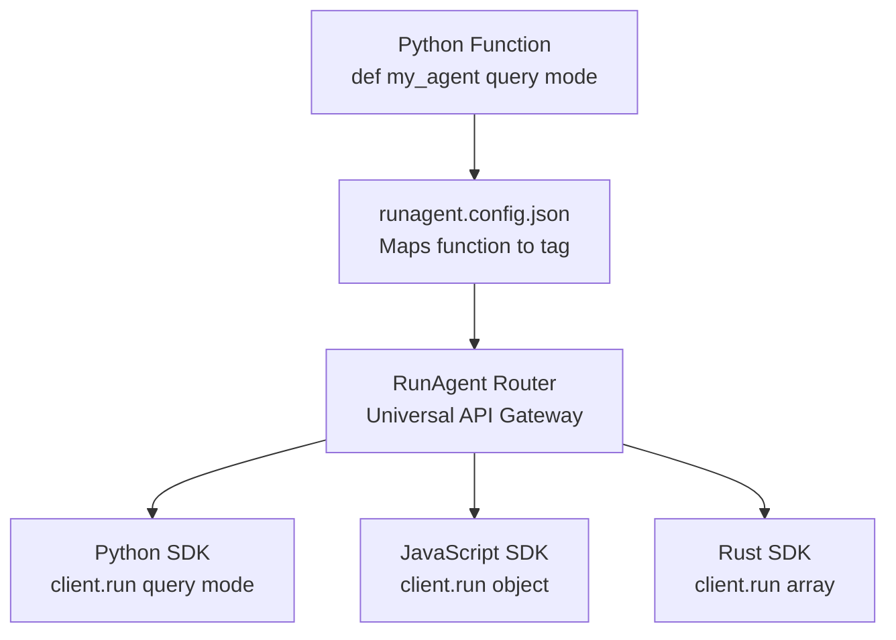

import NeedHelp from '/snippets/need-help.mdx';

<Info>
  **Prerequisites**: Python 3.8+ and pip installed on your system
</Info>

## The Magic You're About to Experience

In the next 5 minutes, you'll:
1. **Deploy a Python agent** that responds intelligently to questions
2. **Call it from multiple languages** like it's a native function
3. **Stream responses in real-time** across language boundaries
4. **Understand why** this changes everything for AI development

Ready? Let's make some magic happen ✨

## Installation: Your Gateway to Multi-Language AI

Install RunAgent CLI (includes Python SDK):

```bash
pip install runagent
```

Verify the installation:

```bash
runagent --version
```

<Note>
**What just happened?** You now have both a powerful CLI for deploying agents AND a Python SDK for accessing them. Two tools, one install!
</Note>

## Create Your First Agent: From Zero to Intelligence

Let's create a simple but intelligent agent that demonstrates RunAgent's core superpower:

<Steps>
  <Step title="Initialize the Magic">
    ```bash
    runagent init my_agent
    cd my_agent
    ```
    
    **What RunAgent just created for you:**
    ```
    my_agent/
    ├── main.py                # Your agent's brain (two smart functions)
    ├── email_agent.py         # Mock AI client (no API keys needed!)  
    ├── runagent.config.json   # The bridge to other languages
    └── __init__.py            # Python package magic
    ```
    
    <Note>
      **Pro insight**: This isn't just boilerplate. Each file serves a specific purpose in making your Python agent accessible from any programming language.
    </Note>
  </Step>
  
  <Step title="Peek Under the Hood: See Your Agent's Brain">
    Your agent has two functions that will become universally accessible APIs:
    
    <CodeGroup>
    ```python Non-streaming Intelligence
    def mock_response(message, role="user"):
        """Your agent's instant-response mode"""
        client = MockOpenAIClient()

        prompt = [{"role": role, "content": message}]
        response = client.create(model="gpt-4", messages=prompt)

        print(f"Tokens used: {response.usage_tokens}")
        print(f"Response time: {response.response_time:.2f}s")

        return response.content  # Complete response, all at once
    ```
    
    ```python Streaming Intelligence
    def mock_response_stream(message, role="user") -> Iterator[str]:
        """Your agent's real-time streaming mode"""
        client = MockOpenAIClient()
        prompt = [{"role": role, "content": message}]
        
        for chunk in client.create(model="gpt-4", messages=prompt, stream=True):
            if not chunk.finished:
                yield chunk.delta  # Stream words as they're "generated"
            else:
                yield "\n[STREAM COMPLETE]"
    ```
    </CodeGroup>
    
    **The "Aha!" Moment**: These Python functions accept `message` and `role` parameters. That's exactly what you'll pass from JavaScript, Rust, or any other language—RunAgent handles the translation!
  </Step>
  
  <Step title="The Configuration Bridge">
    Open `runagent.config.json` to see how Python functions become universal APIs:
    
    ```json
    {
      "agent_name": "my-agent",
      "description": "A simple placeholder agent",
      "framework": "default",
      "agent_architecture": {
        "entrypoints": [
          {
            "file": "main.py",
            "module": "mock_response", 
            "tag": "minimal"
          },
          {
            "file": "main.py",
            "module": "mock_response_stream",
            "tag": "minimal_stream"
          }
        ]
      }
    }
    ```
    
    **What this means**: 
    - Your `mock_response` function becomes accessible via the `minimal` tag
    - Your streaming function gets the `minimal_stream` tag (note the `_stream` suffix!)
    - Any language can now call these functions by their tags
  </Step>
  
  <Step title="Activate Your Agent">
    Launch your agent into the RunAgent universe:
    
    ```bash
    runagent serve .
    ```
    
    **You'll see magic happen:**
    ```
    🚀 Agent Starting...
    📦 Agent ID: agent_abc123
    🌐 Server running at: http://localhost:8000
    ✅ Agent ready for multi-language access!
    ```
    
    **Critical insight**: That `agent_id` is your agent's universal address. Any programming language can now connect to your Python intelligence using this ID!
  </Step>
</Steps>

## The Multi-Language Magic: Same Agent, Every Language

Now comes the mind-blowing part. Your Python agent is now accessible from any supported language as if it were written natively in that language.

### Standard Responses: Get Complete Intelligence

<Tabs>
  <Tab title="🔥 CLI - Zero Code Testing">
    The fastest way to prove the magic works:
    ```bash
    runagent run --id agent_abc123 --local --tag minimal \
      --message "Explain why the sky is blue" \
      --role user
    ```
    
    **Live output:**
    ```
    🚀 RunAgent Configuration:
       Agent ID: agent_abc123
       Tag: minimal
       Local: Yes
    🔍 Auto-resolved address: 127.0.0.1:8000
    🤖 Executing agent: agent_abc123
    ✅ Agent execution completed!
    
    The sky appears blue due to a phenomenon called Rayleigh scattering...
    ```
    
    **What just happened?** You called your Python function from the command line with zero setup!
  </Tab>

  <Tab title="Python SDK - Native Feel">
    ```python
    from runagent import RunAgentClient
    
    # Connect to your agent (replace with your actual agent_id)
    ra = RunAgentClient(
        agent_id="agent_abc123",
        entrypoint_tag="minimal",
        local=True
    )
    
    # Call your agent like it's a local function
    result = ra.run(
        message="Analyze the benefits of remote work for software teams",
        role="user"
    )
    print(result)
    ```
    
    **The magic**: This feels like calling a local Python function, but it's actually making network calls to your deployed agent!
  </Tab>
  
  <Tab title="JavaScript SDK - Promise Paradise">
    First, install in your JS project:
    ```bash
    npm install runagent
    ```
    
    Then use your Python agent from JavaScript:
    ```javascript
    import { RunAgentClient } from 'runagent';
    
    const ra = new RunAgentClient({
      agentId: "agent_abc123",
      entrypointTag: "minimal", 
      local: true
    });
    
    await ra.initialize();
    
    const result = await ra.run({
      message: 'What makes a great engineering team?',
      role: 'user'
    });
    
    console.log(result);
    ```
    
    **Mind-bending reality**: JavaScript developers are now calling your Python AI agent as if it were native JavaScript code!
  </Tab>
  
  <Tab title="🔗 Connection Flexibility">
    You can connect using the server URL instead of agent_id:
    ```python
    from runagent import RunAgentClient
    
    ra = RunAgentClient(
        host="localhost",
        port=8000,
        entrypoint_tag="minimal",
        local=True
    )
    
    result = ra.run(message="Hello from any language!")
    print(result)
    ```
    
    **Why this matters**: You can deploy to any server and connect from anywhere!
  </Tab>
</Tabs>

### Streaming Intelligence: Real-Time AI Responses

Watch your Python agent stream responses in real-time to any language:

<Tabs>
  <Tab title="🔥 CLI - Live Streaming">
    Experience real-time AI streaming in your terminal:
    ```bash
    runagent run --id agent_abc123 --local --tag minimal_stream \
      --message "Write a creative story about AI agents"
    ```
    
    **Live streaming output:**
    ```
    🚀 RunAgent Configuration:
       Agent ID: agent_abc123
       Tag: minimal_stream
       Local: Yes
    🔍 Auto-resolved address: 127.0.0.1:8000
    
    Once
     upon
     a
     time,
     in
     a
     digital
     realm
     far
     beyond
     the
     clouds...
    [STREAM COMPLETE]
    ```
    
    **What's happening**: Your Python generator function is streaming across the network in real-time!
  </Tab>

  <Tab title="Python SDK - Pythonic Streaming">
    ```python
    from runagent import RunAgentClient
    
    # Connect to streaming entrypoint (note the '_stream' tag)
    ra = RunAgentClient(
        agent_id="agent_abc123", 
        entrypoint_tag="minimal_stream",
        local=True
    )
    
    # Stream responses as they generate
    for chunk in ra.run(
        message="Explain quantum computing step by step"
    ):
        print(chunk, end="", flush=True)
    ```
    
    **The beauty**: This looks like a normal Python iterator, but chunks are streaming from your deployed agent in real-time!
  </Tab>
  
  <Tab title="JavaScript - Async Iterator Magic">
    ```javascript
    import { RunAgentClient } from 'runagent';
    
    const ra = new RunAgentClient({
      agentId: "agent_abc123",
      entrypointTag: "minimal_stream",  // The magic '_stream' suffix
      local: true
    });
    
    await ra.initialize();
    
    const stream = await ra.run({
      message: 'Write a poem about coding'
    });
    
    // Modern JavaScript async iteration
    for await (const chunk of stream) {
      process.stdout.write(chunk);
    }
    ```
    
    **Mind-blown moment**: JavaScript developers are consuming real-time streams from your Python agent using native async iterators!
  </Tab>
  
  <Tab title="Rust - High-Performance Streaming">
    ```rust
    use runagent::client::RunAgentClient;
    use serde_json::json;
    use futures::StreamExt;
    
    #[tokio::main]
    async fn main() -> Result<(), Box<dyn std::error::Error>> {
        let client = RunAgentClient::new("agent_abc123", "minimal_stream", true).await?;
        
        let mut stream = client.run_stream(&[
            ("message", json!("Explain machine learning concepts"))
        ]).await?;
        
        while let Some(chunk) = stream.next().await {
            print!("{}", chunk?);
        }
        
        Ok(())
    }
    ```
    
    **Performance revelation**: Rust developers get zero-copy streaming from your Python agent with full type safety!
  </Tab>

  <Tab title="Go - Streaming">
    ```go
    package main

    import (
      "context"
      "fmt"
      "log"
      "time"
      "github.com/runagent-dev/runagent/runagent-go/runagent/pkg/client"
    )

    func main() {
      c, err := client.NewWithAddress("841debad-7433-46ae-a0ec-0540d0df7314", "minimal_stream", true, "localhost", 8450)
      if err != nil {
        log.Fatal(err)
      }
      defer c.Close()

      ctx, cancel := context.WithTimeout(context.Background(), 2*time.Minute)
      defer cancel()

      s, err := c.RunStream(ctx, map[string]interface{}{"role": "user", "message": "Analyze the benefits of remote work for software teams"})
      if err != nil {
        log.Fatal(err)
      }
      defer s.Close()

      for {
        data, hasMore, err := s.Next(ctx)
        if err != nil {
          log.Fatal(err)
        }
        if !hasMore {
          break
        }
        fmt.Printf("Received: %v\n", data)
      }
    }
    ```
    </Tab>
</Tabs>

## Level Up: Real AI Frameworks

Ready to move beyond mock responses? RunAgent works with any Python AI framework:

<Tabs>
  <Tab title="🔗 LangGraph - Complex Workflows">
    ```bash
    runagent init my_langgraph_agent --langgraph
    cd my_langgraph_agent
    
    # Add your AI power
    echo "OPENAI_API_KEY=your-key-here" > .env
    
    # Install and activate
    pip install -r requirements.txt
    runagent serve .
    ```
    
    **What you get**: Multi-step reasoning agents with state management, accessible from any language!
  </Tab>
  
  <Tab title="CrewAI - Multi-Agent Teams">
    ```bash
    runagent init my_crew_agent --crewai
    cd my_crew_agent
    
    # Configure your AI crew
    echo "OPENAI_API_KEY=your-key-here" > .env
    pip install -r requirements.txt
    runagent serve .
    ```
    
    **What you get**: Coordinated AI agent teams working together, controllable from JavaScript, Rust, Go, or Python!
  </Tab>
  
  <Tab title="🔧 Custom Framework">
    ```bash
    runagent init my_custom_agent
    cd my_custom_agent
    
    # Edit main.py with your framework
    # Update runagent.config.json with your entrypoints
    runagent serve .
    ```
    
    **What you get**: Total freedom to use any Python AI library while maintaining multi-language access!
  </Tab>
</Tabs>

## Understanding the Universal Entrypoint System

This is the core concept that makes RunAgent revolutionary:

### How Function Signatures Become Universal APIs



**The Revolutionary Insight**: Your Python function signature automatically defines the API contract for all programming languages. Change the Python function, and all language SDKs automatically adapt!

### Streaming: The Real-Time Superpower

When you use `Iterator[str]` in Python, RunAgent automatically:
- 🔄 **Establishes WebSocket connections** for real-time data flow
- 📡 **Streams chunks immediately** as your function yields them
- 🌐 **Provides native iteration patterns** in each target language
- ✅ **Handles connection lifecycle** and error recovery

```python
# Your Python generator
def generate_report(topic: str) -> Iterator[str]:
    yield "# Report: " + topic + "\n\n"
    yield "## Introduction\n"
    # ... more yields
    
# Becomes JavaScript async iterator
for await (const chunk of stream) {
    document.body.innerHTML += chunk;
}

# Becomes Rust futures stream  
while let Some(chunk) = stream.next().await {
    println!("{}", chunk?);
}
```

## What Just Happened? The Full Picture

In these 5 minutes, you've experienced something revolutionary:

<CardGroup cols={2}>
  <Card title="🧠 Universal AI Access" icon="brain">
    Your Python AI agent is now callable from any programming language with native-feeling APIs
  </Card>
  <Card title="⚡ Real-Time Streaming" icon="bolt">
    Streaming responses work seamlessly across language boundaries with zero setup
  </Card>
  <Card title="🔧 Zero Infrastructure" icon="wrench">
    No REST APIs to build, no WebSocket handling, no deployment complexity
  </Card>
  <Card title="🚀 Production Ready" icon="rocket">
    The same code and SDKs will work in production with automatic scaling
  </Card>
</CardGroup>

## The Path Forward: Your RunAgent Journey

<CardGroup cols={2}>
  <Card title="Core Concepts Deep Dive" icon="lightbulb" href="/explanation/core-concepts">
    Understand the architecture that makes this magic possible
  </Card>
  <Card title="Multi-Language SDKs" icon="code" href="/reference/sdk/overview">
    Master the native patterns for each supported language
  </Card>
  <Card title="Real-World Examples" icon="target" href="/resources/examples-index">
    See production-ready agents built with popular frameworks
  </Card>
  <Card title="Production Deployment" icon="cloud" href="/runagent-cloud/cloud-deployment">
    Scale your agents to serve millions of requests
  </Card>
</CardGroup>

## Common Questions from New Users

<AccordionGroup>
  <Accordion title="Why can't I connect to my agent?">
    **Most common fix**: Make sure your agent is still running:
    ```bash
    runagent serve .  # Keep this running in one terminal
    ```
    Then use the SDK in another terminal or Python script. The agent needs to stay active to receive requests!
  </Accordion>
  
  <Accordion title="My entrypoint tag isn't found">
    **Check your configuration**: The tag in your SDK call must exactly match what's in `runagent.config.json`:
    ```bash
    cat runagent.config.json | grep -A 5 "entrypoints"
    ```
    Remember: streaming tags must end with `_stream`!
  </Accordion>
  
  <Accordion title="I get import errors with framework templates">
    **Install the dependencies**: Framework templates come with requirements:
    ```bash
    pip install -r requirements.txt  # For LangGraph, CrewAI, etc.
    ```
  </Accordion>
  
  <Accordion title="Port 8000 is already in use">
    **Use a different port**:
    ```bash
    runagent serve . --port 8080
    ```
    Then connect using `port=8080` in your SDK calls.
  </Accordion>
</AccordionGroup>

<Note>
**🎉 Congratulations!** You've just experienced the future of AI development. Your Python agents can now be accessed from any programming language with the same ease as calling local functions. This is just the beginning—imagine what you'll build next!
</Note>

**Ready to go deeper?** Join our [Discord community](https://discord.gg/runagent) to see what other developers are creating with RunAgent!

<NeedHelp context="Deploy Your First Agent" />
