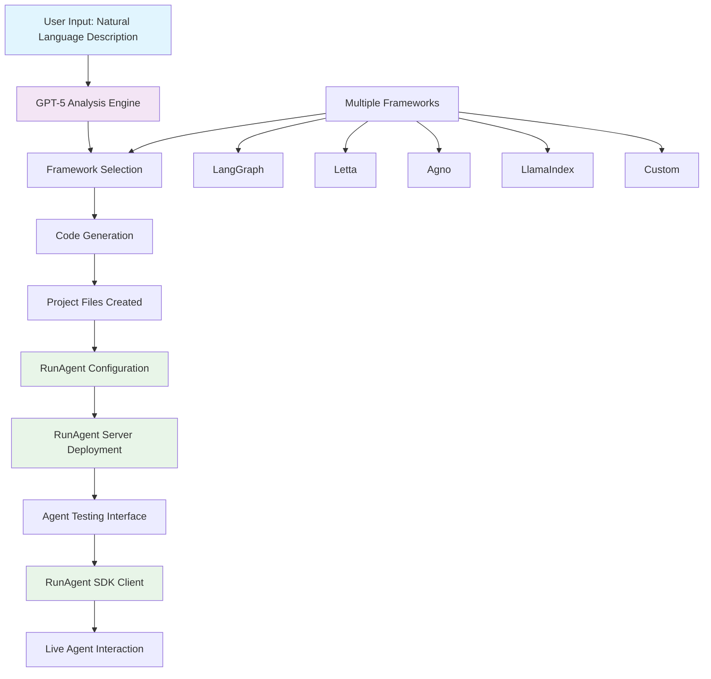

# RunAgent Generator

RunAgent Generator is an intelligent system that automatically creates custom AI agents based on natural language descriptions. Using GPT-5 for analysis and code generation, it supports multiple AI frameworks and provides a complete development environment for AI agents.

## User Interface

| Agent Builder Interface |
|:-----------------------:|
|  |
| Create agents through natural language |

| Agent Testing Interface |
|:-----------------------:|
|  |
 | Test and interact with generated agents |

## Overview

The system analyzes user requirements in natural language and generates complete, working AI agents with:
- Framework-specific code (LangGraph, Letta, Agno, LlamaIndex, or custom)
- Configuration files and dependencies
- Test scripts and SDK integration
- Web interfaces for testing and interaction
- Automatic server deployment

## Features

### Core Capabilities
- **Natural Language Processing**: Describe your agent requirements in plain English
- **Multi-Framework Support**: Generate agents for LangGraph, Letta, Agno, LlamaIndex, or custom frameworks
- **Intelligent Framework Selection**: Automatically chooses the best framework based on requirements
- **Dynamic Input Configuration**: Creates custom input fields based on agent functionality
- **Real-time Code Generation**: Uses GPT-5 to generate production-ready code
- **Workflow Visualization**: Generates Mermaid diagrams showing agent workflows
- **Complete Project Setup**: Includes all necessary files, dependencies, and configurations

### Web Interfaces
- **Agent Builder Interface**: Interactive chat-based agent creation
- **Agent Testing Interface**: Comprehensive testing environment with streaming support
- **Multi-session Management**: Handle multiple agent creation sessions simultaneously
- **Responsive Design**: Works on desktop and mobile devices

### Testing & Deployment
- **Automatic Server Deployment**: Starts RunAgent servers for generated agents
- **Python SDK Integration**: Generates test scripts using the RunAgent Python SDK
- **Streaming Support**: Tests both synchronous and streaming agent responses
- **Live Testing**: Real-time agent testing with streaming output
- **Debug Endpoints**: Built-in debugging tools for troubleshooting

## Architecture

### System Overview



### Components
1. **FastAPI Backend** (`main.py`): Core API server handling agent generation and management
2. **Agent Builder UI** (`index.html`): Web interface for creating agents through natural language
3. **Agent Testing UI** (`agent.html`): Interface for testing and interacting with generated agents
4. **Test SDK** (`test_sdk.py`): Python script for testing agents via SDK

### Workflow
1. **Request Analysis**: GPT-5 analyzes user requirements and extracts agent specifications
2. **Framework Selection**: System chooses optimal framework based on requirements
3. **Code Generation**: Generates framework-specific agent code and configurations
4. **Project Creation**: Creates complete project structure with all necessary files
5. **RunAgent Integration**: Creates RunAgent configuration and deployment files
6. **Server Deployment**: Automatically starts RunAgent server for the new agent
7. **Testing Interface**: Provides web interface for immediate agent testing via RunAgent SDK

### RunAgent Integration

RunAgent serves as the deployment and interaction layer for generated agents:

- **Configuration Generation**: Each agent gets a `runagent.config.json` file specifying entrypoints, input schemas, and environment requirements
- **Server Deployment**: Generated agents are automatically deployed using `runagent serve` command
- **SDK Integration**: Test scripts and web interfaces use `RunAgentClient` for seamless agent interaction
- **Multi-Entrypoint Support**: Agents support both synchronous and streaming endpoints through RunAgent's architecture
- **Local Development**: All agents run locally with RunAgent handling server management and client connections

## Installation

### Prerequisites
- Python 3.8 or higher
- OpenAI API key with GPT-5 access
- RunAgent SDK installed (`pip install runagent`)

### Setup
1. **Clone or download the project files**
2. **Install dependencies**:
   ```bash
   pip install fastapi uvicorn openai pathlib shutil subprocess threading
   ```
3. **Set environment variables**:
   ```bash
   export OPENAI_API_KEY="your-gpt-5-api-key"
   ```
4. **Create required directories**:
   ```bash
   mkdir generated_agents static
   ```
5. **Add static assets** (optional):
   - Add `icon.png` to the `static/` directory for UI branding

## Usage

### Starting the Server
```bash
python main.py
```
The server will start on `http://localhost:8000`

### Creating Agents

#### Web Interface
1. Navigate to `http://localhost:8000/static/index.html`
2. Describe your agent requirements in natural language
3. Review the generated agent plan and workflow diagram
4. Confirm generation to create the agent
5. Access the agent through the provided interface URL

#### Example Requests
- "Create a weather agent that takes a location and returns current conditions using LangGraph"
- "Build a math solver that can solve equations step by step with Agno"
- "Make a research assistant that can search and summarize information using LlamaIndex"
- "I want a content writer agent that takes a topic and style and generates articles"

#### API Endpoint
```bash
curl -X POST "http://localhost:8000/chat" \
  -H "Content-Type: application/json" \
  -d '{
    "message": "Create a weather agent using LangGraph",
    "session_id": "optional-session-id"
  }'
```

### Testing Agents

#### Web Interface
1. Use the agent URL provided after generation
2. Configure input fields based on your agent's requirements
3. Test with both synchronous and streaming modes
4. View detailed results and debug information

#### Python SDK Testing
```bash
python test_sdk.py <agent_id> <port>
```

#### Manual Testing Script
Each generated agent includes an `agent_test.py` script:
```bash
cd generated_agents/<session_id>/
python agent_test.py <agent_id> localhost <port> "test message"
```

## Generated Project Structure

Each generated agent creates a complete project:

```
generated_agents/<session_id>/
├── agent.py                 # Main agent code
├── requirements.txt         # Python dependencies
├── runagent.config.json    # RunAgent configuration
├── agent_test.py           # SDK test script
├── .env                    # Environment variables
└── README.md               # Agent documentation
```

### Configuration Files

#### runagent.config.json
- Agent metadata and description
- Framework and template information
- Input field specifications and types
- Entrypoint configurations
- Environment variable requirements

#### requirements.txt
- Framework-specific dependencies
- Version specifications
- Additional libraries as needed

## API Reference

### Core Endpoints

#### POST /chat
Create or continue agent generation conversation
- **Body**: `{"message": "string", "session_id": "optional"}`
- **Response**: Chat response with stage information and agent data

#### GET /agent/{agent_id}
Retrieve comprehensive agent information
- **Response**: Agent configuration, status, and connection details

#### GET /agent/{agent_id}/run-test
Execute agent test with custom inputs
- **Query Params**: `test_message`, `input_data`, `streaming`, `entrypoint_tag`
- **Response**: Test results and agent output

#### GET /agent/{agent_id}/run-test-stream
Live streaming test with real-time output
- **Query Params**: `test_message`, `input_data`, `entrypoint_tag`
- **Response**: Server-sent events with streaming output

### Debug Endpoints

#### GET /agent/{agent_id}/sdk
Download generated Python test script

#### GET /debug/test-agent/{agent_id}
Debug agent functionality with multiple endpoint tests

#### GET /debug/clear-sessions
Clear all active sessions and agents (development only)

#### GET /health
Server health check

## Configuration

### Environment Variables
- `OPENAI_API_KEY`: Required for GPT-5 access
- `RUNAGENT_LOG_LEVEL`: Logging level (default: INFO)
- `RUNAGENT_DISABLE_DB`: Disable database features (set to 'true')

### Agent Input Configuration
Agents automatically configure input fields based on requirements:
- **Dynamic Field Generation**: Creates appropriate input fields for agent functionality
- **Type Validation**: Supports string, number, boolean, array, email, URL types
- **Default Values**: Provides sensible defaults for non-primary fields
- **Descriptions**: Generates helpful descriptions for each input field

## Development

### Extending Framework Support
To add support for a new framework:
1. Create a new `generate_[framework]_files()` function in `main.py`
2. Update the framework selection logic in `analyze_user_request()`
3. Add framework-specific dependencies and configuration templates

### Customizing Agent Templates
Agent templates can be customized by modifying the generation functions:
- Update code templates for different agent behaviors
- Modify configuration schemas for new input types
- Add framework-specific features and capabilities

### Adding New Features
- **UI Enhancements**: Modify `index.html` and `agent.html` for interface improvements
- **API Extensions**: Add new endpoints in `main.py` for additional functionality
- **Testing Tools**: Extend `test_sdk.py` and generated test scripts

## Troubleshooting

### Common Issues

#### Agent Generation Fails
- Verify OpenAI API key is set and has GPT-5 access
- Check that all required dependencies are installed
- Ensure sufficient disk space for generated files

#### Agent Server Won't Start
- Verify RunAgent SDK is installed: `pip install runagent`
- Check that ports are not already in use
- Review generated requirements.txt for missing dependencies

#### Agent Tests Fail
- Confirm agent server is running on expected port
- Verify input field names match agent configuration
- Check entrypoint tags are correctly specified

#### Streaming Tests Timeout
- Increase timeout values in test scripts
- Verify agent supports streaming entrypoints
- Check network connectivity to agent server

### Debug Information
Use the debug endpoints to gather troubleshooting information:
- `/debug/test-agent/{agent_id}` for comprehensive agent testing
- `/health` for server status
- Check browser console for JavaScript errors in web interfaces

### Log Analysis
Server logs provide detailed information about:
- Agent generation process
- Framework selection reasoning
- Server startup and configuration
- Error messages and stack traces

## Performance Considerations

### Resource Usage
- Each agent runs in its own RunAgent server process
- Memory usage scales with number of active agents
- Generated agents include efficient resource management

### Optimization Tips
- Limit concurrent agent generation requests
- Clean up unused agent sessions periodically
- Monitor system resources when running multiple agents
- Use appropriate framework selection for performance requirements

## Security Notes

### API Key Management
- Store OpenAI API keys securely
- Use environment variables for sensitive configuration
- Implement rate limiting for production deployments

### Generated Code Security
- Review generated agent code before deployment
- Validate input fields and types in production
- Implement appropriate access controls for agent endpoints

### Network Security
- Run on private networks when possible
- Use HTTPS in production environments
- Implement authentication for sensitive agents

## Contributing

When contributing to this project:
1. Follow existing code structure and patterns
2. Add comprehensive error handling
3. Update documentation for new features
4. Test with multiple frameworks and configurations
5. Consider backward compatibility for existing agents

## License

This project is provided as-is for educational and development purposes. Ensure compliance with OpenAI's terms of service when using GPT-5 for agent generation.
